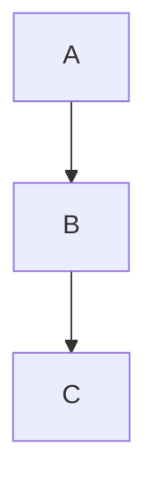
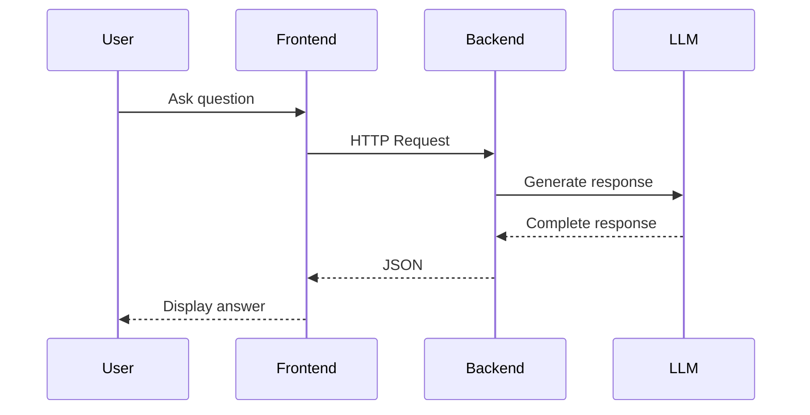
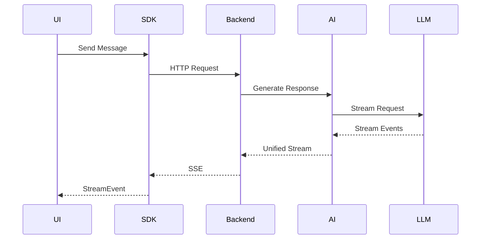
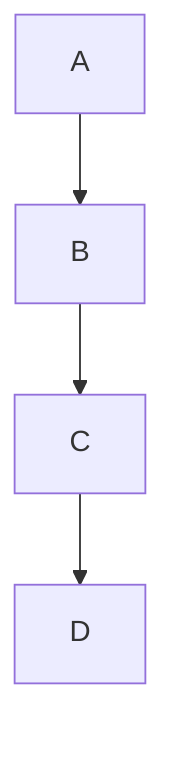

# MDX File Specification for AI Learning Content

## Purpose

This document provides a complete specification for creating MDX files in the AI Learning Content repository. It is designed to be passed directly to ChatGPT or AI agents to generate consistent, properly-formatted learning content that integrates with the AI Learning Portal application.

---

## Table of Contents

1. [File Organization](#file-organization)
2. [Frontmatter Schema](#frontmatter-schema)
3. [Content Structure](#content-structure)
4. [Markdown Formatting Rules](#markdown-formatting-rules)
5. [Special Components](#special-components)
6. [Cross-References](#cross-references)
7. [Content Patterns](#content-patterns)
8. [Validation Rules](#validation-rules)
9. [Examples](#examples)

---

## File Organization

### Directory Structure

```
ai-learning-content/
├── roadmap/                          # Sequential learning path (Day 1-100)
│   ├── day-001-{topic}/
│   │   └── lesson.mdx
│   ├── day-002-{topic}/
│   │   └── lesson.mdx
│   └── ...
├── handbook/                         # Reference documentation
│   ├── fundamentals/
│   │   ├── ai-engineering-philosophy.mdx
│   │   └── local-ai.mdx
│   ├── llms/
│   │   ├── llm-basics.mdx
│   │   ├── tokens.mdx
│   │   ├── context-window.mdx
│   │   └── provider-comparison.mdx
│   ├── prompting/
│   │   ├── prompt-engineering.mdx
│   │   ├── prompt-templates.mdx
│   │   └── role-prompting.mdx
│   ├── context/
│   │   ├── context-engineering.mdx
│   │   └── context-builder.mdx
│   ├── streaming/
│   │   ├── streaming-basics.mdx
│   │   ├── sse.mdx
│   │   ├── readable-stream.mdx
│   │   └── provider-abstraction.mdx
│   └── architecture/
│       ├── ai-core.mdx
│       ├── ai-sdk.mdx
│       ├── ai-backend.mdx
│       └── provider-adapters.mdx
├── glossary/
│   └── glossary.mdx
├── projects/
│   ├── ai-chat/
│   ├── ai-learning-portal/
│   └── pr-reviewer/
├── resources/
├── cheatsheets/
└── generated/
    └── content-index.json            # Auto-generated, do not edit
```

### Naming Conventions

**Roadmap Files:**
- Directory: `day-{NNN}-{kebab-case-topic}/`
- File: `lesson.mdx`
- Example: `day-003-prompt-engineering/lesson.mdx`

**Handbook Files:**
- File: `{kebab-case-topic}.mdx`
- Example: `provider-comparison.mdx`

**ID Format:**
- Roadmap: `day-{NNN}-{kebab-case-topic}`
- Handbook: `handbook.{section}.{kebab-case-topic}`
- Example: `handbook.llms.provider-comparison`

---

## Frontmatter Schema

All MDX files MUST include YAML frontmatter enclosed in `---` markers.

### Required Fields

```yaml
---
id: unique-identifier-here          # REQUIRED: Unique ID (see ID format rules)
title: "Lesson Title Here"          # REQUIRED: Human-readable title
description: >                     # REQUIRED: Multi-line description
  Detailed description of the lesson
  content and learning outcomes.
---
```

### Roadmap Lesson Fields

```yaml
---
id: day-001-ai-engineering-overview
type: roadmap                       # REQUIRED: Content type
day: 1                              # REQUIRED: Day number (1-100)
slug: ai-engineering-overview       # REQUIRED: URL-friendly slug
title: "AI Engineering Roadmap"     # REQUIRED
subtitle: "Becoming an AI Engineer" # OPTIONAL: Brief tagline
description: >                      # REQUIRED
  Multi-line description using YAML
  folded block scalar (>) for proper
  formatting.
version: 1.0.0                      # REQUIRED: Semantic version
status: completed                   # REQUIRED: completed | not-started | in-progress
difficulty: Beginner                # REQUIRED: Beginner | Intermediate | Advanced
estimatedTime: "2 Hours"            # REQUIRED: Estimated completion time
readingTime: "35 min"               # REQUIRED: Estimated reading time
phase: "Foundations"                # REQUIRED: Learning phase name
categories:                         # REQUIRED: Array of category strings
  - "ai-engineering"
  - "fundamentals"
topics:                             # REQUIRED: Array of topic strings
  - "AI Engineering"
  - "LLMs"
tags:                               # REQUIRED: Array of tag strings
  - "ai"
  - "llm"
prerequisites:                      # REQUIRED: Array of prerequisite IDs
  - "day-001-ai-engineering-overview"
learningObjectives:                 # REQUIRED: Array of learning objectives
  - "Understand the role of an AI Engineer"
  - "Learn how AI Engineering differs from traditional software engineering"
projects:                           # REQUIRED: Array of related project names
  - "ai-chat"
  - "ai-learning-portal"
assignment: true                    # REQUIRED: Boolean flag
quiz: false                         # REQUIRED: Boolean flag
pdf: true                           # REQUIRED: Boolean flag
searchable: true                    # REQUIRED: Boolean flag
related:                            # REQUIRED: Array of related content IDs
  - [handbook-related-content.title](handbook-related-content.if)
lastUpdated: "2026-07-05"          # REQUIRED: ISO date format (YYYY-MM-DD)
---
```

### Handbook Document Fields

```yaml
---
id: handbook-llms-provider-comparison  # REQUIRED
title: "AI Provider Comparison"        # REQUIRED
description: >                         # REQUIRED
  Comprehensive comparison of major AI
  providers including Anthropic, OpenAI,
  Ollama, and Google.
category: "LLM Fundamentals"          # REQUIRED: Category name
topics:                                # REQUIRED: Array of topics
  - "AI Providers"
  - "Anthropic"
  - "OpenAI"
related:                               # REQUIRED: Array of related content IDs
  - "roadmap/day-002-llms-and-provider-landscape"
  - "handbook/llms/llm-basics"
---
```

### Glossary Entry Fields

```yaml
---
id: glossary                           # REQUIRED
title: "AI Engineering Glossary"       # REQUIRED
description: >                         # REQUIRED
  Comprehensive glossary of AI Engineering
  terms and definitions.
category: "Reference"                  # REQUIRED
topics:                                # REQUIRED
  - "Glossary"
  - "Definitions"
related:                               # REQUIRED
  - "handbook/fundamentals/ai-engineering-philosophy"
---
```

### Field Specifications

| Field | Type | Required | Constraints |
|-------|------|----------|-------------|
| `id` | string | Yes | Unique, kebab-case, matches directory structure |
| `type` | string | Yes | `roadmap` \| `handbook` \| `glossary` \| `project` |
| `day` | integer | Yes | 1-100 for roadmap, 999 for others |
| `slug` | string | Yes | URL-friendly, lowercase, hyphens only |
| `title` | string | Yes | Human-readable, max ~60 chars |
| `subtitle` | string | No | Brief tagline, max ~100 chars |
| `description` | string | Yes | Multi-line, use `>` YAML syntax |
| `version` | string | Yes | Semantic versioning (e.g., "1.0.0") |
| `status` | string | Yes | `completed` \| `not-started` \| `in-progress` |
| `difficulty` | string | Yes | `Beginner` \| `Intermediate` \| `Advanced` |
| `estimatedTime` | string | Yes | Format: "X Hours" or "X Hours Y min" |
| `readingTime` | string | Yes | Format: "X min" |
| `phase` | string | Yes | Learning phase name (e.g., "Foundations") |
| `categories` | array | Yes | Array of category strings |
| `topics` | array | Yes | Array of topic strings |
| `tags` | array | Yes | Array of tag strings (lowercase) |
| `prerequisites` | array | Yes | Array of content IDs (empty `[]` if none) |
| `learningObjectives` | array | Yes | Array of objective strings |
| `projects` | array | Yes | Array of project names |
| `assignment` | boolean | Yes | `true` \| `false` |
| `quiz` | boolean | Yes | `true` \| `false` |
| `pdf` | boolean | Yes | `true` \| `false` |
| `searchable` | boolean | Yes | `true` \| `false` |
| `related` | array | Yes | Array of related content IDs |
| `lastUpdated` | string | Yes | ISO date: YYYY-MM-DD |

---

## Content Structure

### Standard Lesson Structure (Roadmap)

Every roadmap lesson MUST follow this structure:

```markdown
---
# FRONTMATTER HERE
---

# Day N — Lesson Title

---

# Overview

Brief introduction to the topic and its importance.

---

# Learning Objectives

By the end of today's lesson, you should be able to:

- Objective 1
- Objective 2
- Objective 3

---

# Main Content Sections

## Section 1 Title

Content here...

---

## Section 2 Title

Content here...

---

# Best Practices

- Practice 1
- Practice 2
- Practice 3

---

# Common Misconceptions

❌ **Misconception 1**

Explanation of why this is wrong.

---

❌ **Misconception 2**

Explanation of why this is wrong.

---

# Assignment

## Objective

Clear statement of what to do.

## Tasks

1. Task 1
2. Task 2
3. Task 3

## Deliverables

- Deliverable 1
- Deliverable 2

---

# Mini Project

## Objective

Brief description of the mini project.

## Requirements

1. Requirement 1
2. Requirement 2
3. Requirement 3

## Focus

- Focus area 1
- Focus area 2

---

# Key Takeaways

- Takeaway 1
- Takeaway 2
- Takeaway 3

---

# Revision Notes

- Note 1
- Note 2
- Note 3

---

# Knowledge Graph

## Concepts Introduced

- Concept 1
- Concept 2
- Concept 3

## Builds Upon

- Day N-1 — Previous Lesson Title

## Enables Future Topics

- Future Topic 1
- Future Topic 2
- Future Topic 3

---

# Discussion Notes

Key decisions and architectural choices made during discussions.

---

# Next Lesson

**Day N+1 — Next Lesson Title**

Brief preview of what's coming next.
```

### Handbook Document Structure

```markdown
---
# FRONTMATTER HERE
---

# Document Title

## Purpose

Brief explanation of what this document covers and why it exists.

---

# Main Sections

## Section 1

Content...

---

## Section 2

Content...

---

# Best Practices

- Practice 1
- Practice 2

---

# Common Issues

## Issue 1

**Problem**: Description

**Solution**: How to fix it

---

# Interview Questions

## Q: Question here?

**A**: Answer here.

---

# Assignment

Assignment details...

---

# Mini Project

Mini project details...

---

# Key Takeaways

- Takeaway 1
- Takeaway 2

---

# Related Documents

- [Related Doc 1](path.to.related)
- [Related Doc 2](path.to.related)
```

### Glossary Structure

```markdown
---
# FRONTMATTER HERE
---

# AI Engineering Glossary

## Purpose

Explanation of the glossary's purpose.

---

# A

## Term Name

Definition of the term. Can include references to other documents using [Link Text](reference.id).

---

# B

## Another Term

Definition...

---

# Acronyms

| Acronym | Full Form |
|---------|-----------|
| AI | Artificial Intelligence |
| API | Application Programming Interface |
| LLM | Large Language Model |

---

# Related Documents

- [Document 1](reference.id)
- [Document 2](reference.id)
```

---

## Markdown Formatting Rules

### Headers

- Use `#` for main title (H1) - only once per file
- Use `##` for major sections (H2)
- Use `###` for subsections (H3)
- Use `####` for sub-subsections (H4) - avoid deeper nesting

### Text Formatting

```markdown
**Bold text** for emphasis
*Italic text* for subtle emphasis
`inline code` for technical terms, code references, and short examples
```

### Lists

**Unordered Lists:**
```markdown
- Item 1
- Item 2
  - Nested item
  - Another nested item
- Item 3
```

**Ordered Lists:**
```markdown
1. First item
2. Second item
3. Third item
```

### Code Blocks

**Syntax Highlighting:**
````markdown
```typescript
const greeting: string = "Hello, AI!";
```

```python
def hello():
    print("Hello, AI!")
```

```bash
npm install ai-core
```


````

**Inline Code:**
```markdown
Use `const` to declare constants in TypeScript.
```

### Tables

```markdown
| Column 1 | Column 2 | Column 3 |
|----------|----------|----------|
| Value 1  | Value 2  | Value 3  |
| Value 4  | Value 5  | Value 6  |
```

**Table Rules:**
- Always include header row
- Always include separator row (|---|---|)
- Align columns logically (left for text, right for numbers)
- Keep cells concise

### Blockquotes

```markdown
> **Important:** This is an important note.
> 
> Continue the blockquote on multiple lines.
```

### Horizontal Rules

Use `---` to separate major sections:
```markdown
---

# Next Section
```

---

## Special Components

### Mermaid Diagrams

Use Mermaid for architecture diagrams, flowcharts, and sequence diagrams:

**Flowchart:**
````markdown
```mermaid
flowchart TD
    User --> React
    React --> AI SDK
    AI SDK --> Backend
    Backend --> AI Core
    AI Core --> Provider
```
````

**Sequence Diagram:**
````markdown

````

**Mermaid Rules:**
- Always use triple backticks with `mermaid` language tag
- Keep diagrams simple and focused
- Use descriptive node labels
- Show data flow direction with arrows

### Emoji Usage

Use emoji sparingly for visual markers:

```markdown
✅ Good practice or advantage
❌ Bad practice or disadvantage
📖 Reference to handbook
💡 Tip or insight
⚠️ Warning or caution
🎯 Goal or objective
```

**Rules:**
- Use consistently throughout all content
- Don't overuse (max 1-2 per section)
- Use at the start of list items or paragraphs

### Callout Boxes

Use blockquotes for callouts:

```markdown
> **📖 Handbook Reference:** [Prompt Engineering](handbook.prompting.prompt-engineering)

> **💡 Tip:** Keep prompts modular for better maintainability.

> **⚠️ Warning:** Never hardcode API keys in frontend code.
```

---

## Cross-References

### Internal References

Link to other content using the content ID:

```markdown
📖 **Handbook Reference:** [Prompt Engineering](handbook.prompting.prompt-engineering)

📖 **Handbook Reference:**
- [Understanding Tokens](handbook.llms.tokens)
- [Context Window](handbook.llms.context-window)

See [AI Core Architecture](../architecture/ai-core.mdx) for details.

[Related: Provider Comparison](handbook.llms.provider-comparison)
```

### Reference Formats

**Single Reference:**
```markdown
[Link Text](reference.id)
```

**Multiple References:**
```markdown
📖 **Handbook Reference:**
- [Prompt Engineering](handbook.prompting.prompt-engineering)
- [Role Prompting](handbook.prompting.role-prompting)
- [Prompt Templates](handbook.prompting.prompt-templates)
```

**Relative Path References:**
```markdown
[AI Core Architecture](../architecture/ai-core.mdx)
[Provider Comparison](../../handbook/llms/provider-comparison.mdx)
```

### Reference ID Format

| Content Type | ID Format | Example |
|--------------|-----------|---------|
| Roadmap | `day-{NNN}-{slug}` | `day-003-prompt-engineering` |
| Handbook | `handbook.{section}.{slug}` | `handbook.llms.provider-comparison` |
| Glossary | `glossary` | `glossary` |
| Project | `project.{slug}` | `project.ai-chat` |

---

## Content Patterns

### Comparison Tables

Use tables to compare concepts, tools, or approaches:

```markdown
| Aspect | Software Engineer | AI Engineer |
|--------|------------------|-------------|
| Logic | Deterministic | Probabilistic |
| Input | Structured data | Prompts + context |
| Output | Predictable | Variable |
| Testing | Unit tests | Prompt testing |
```

### Code Examples

Always include language tags and comments:

````markdown
```typescript
// Import the provider
import Anthropic from '@anthropic-ai/sdk';

// Initialize client
const anthropic = new Anthropic();

// Create a message
const message = await anthropic.messages.create({
  model: 'claude-3-5-sonnet-20241022',
  max_tokens: 1024,
  messages: [
    { role: 'user', content: 'Explain quantum computing' }
  ]
});
```
````

### Architecture Diagrams

Use Mermaid flowcharts to show system architecture:

````markdown
```mermaid
flowchart TD
    User --> React
    React --> AI SDK
    AI SDK --> Backend
    Backend --> AI Core
    AI Core --> Provider
    Provider --> LLM
```
````

### Sequential Flows

Use sequence diagrams for request/response flows:

````markdown

````

### Lists of Concepts

Use bulleted lists for concepts and ideas:

```markdown
Context includes any information that helps the model generate a better response:

- Previous conversation
- User preferences
- Uploaded files
- Retrieved documentation
- Current project
- Application settings
- Code snippets
- Database results
- Tool outputs
```

### Step-by-Step Instructions

Use numbered lists for procedures:

```markdown
## Setting Up Ollama

### Step 1: Install Ollama

Follow the installation instructions for your operating system.

### Step 2: Verify Installation

```bash
ollama --version
```

### Step 3: Pull Your First Model

```bash
ollama pull llama3.2
```

### Step 4: Test the Model

```bash
ollama run llama3.2 "Explain what AI is in one sentence."
```
```

---

## Validation Rules

### Frontmatter Validation

1. **ID Uniqueness**: Every file must have a unique `id`
2. **ID Format**: Must match directory structure
   - Roadmap: `day-{NNN}-{slug}` where NNN is zero-padded (001, 002, etc.)
   - Handbook: `handbook.{section}.{slug}`
3. **Required Fields**: All required fields must be present
4. **Date Format**: `lastUpdated` must be YYYY-MM-DD
5. **Array Fields**: Must be valid YAML arrays (use `[]` for empty)
6. **Boolean Fields**: Must be `true` or `false` (not quoted strings)

### Content Validation

1. **H1 Header**: Exactly one `#` header at the start of content
2. **Section Separators**: Use `---` between major sections
3. **Learning Objectives**: Required for all lessons
4. **Assignment**: Must include if `assignment: true`
5. **Quiz**: Must include quiz section if `quiz: true`
6. **Key Takeaways**: Required for all lessons
7. **Revision Notes**: Required for all lessons
8. **Knowledge Graph**: Required for all lessons
9. **Next Lesson**: Required for all lessons (except last in series)

### Markdown Validation

1. **Line Length**: No hard limit, but keep paragraphs readable
2. **Code Blocks**: Always specify language for syntax highlighting
3. **Links**: Use reference format for internal links
4. **Images**: Use relative paths, include alt text
5. **Tables**: Always include header and separator rows

---

## Examples

### Complete Roadmap Lesson Example

```markdown
---
id: day-010-ai-sdk-design
type: roadmap
day: 10
slug: ai-sdk-design
title: "AI SDK Design"
subtitle: "Building Client-Side AI Abstractions"
description: >
  Design the client-side AI SDK that React applications use.
  Learn how to expose clean APIs for streaming, conversations,
  provider selection, and configuration.
version: 1.0.0
status: completed
difficulty: Intermediate
estimatedTime: "3 Hours"
readingTime: "90 min"
phase: "Foundations"
categories:
  - "ai-sdk"
  - "frontend"
topics:
  - AI SDK
  - React Hooks
  - Streaming
  - Client Architecture
tags:
  - sdk
  - frontend
  - react
  - typescript
prerequisites:
  - "day-009-building-ai-core"
learningObjectives:
  - "Understand AI SDK responsibilities"
  - "Design clean client-side APIs"
  - "Implement React hooks for AI"
  - "Handle streaming in the frontend"
projects:
  - "ai-chat"
  - "ai-learning-portal"
assignment: true
quiz: true
pdf: true
searchable: true
related:
  - "handbook/architecture/ai-sdk"
  - "handbook/streaming/readable-stream"
lastUpdated: "2026-07-05"
---

# Day 10 — AI SDK Design

---

# Overview

The AI SDK is the bridge between React applications and the AI Backend.

It provides a clean, type-safe interface that hides the complexity of streaming, conversations, and provider communication.

---

# Learning Objectives

By the end of today's lesson, you should be able to:

- Explain the purpose of the AI SDK
- Design clean client-side APIs
- Implement React hooks for AI functionality
- Handle streaming responses in the frontend
- Manage conversation state

---

# Why the AI SDK Exists

React applications should not:

- Call backend endpoints directly
- Parse streamed data manually
- Manage provider-specific logic
- Handle authentication in components

Instead, the AI SDK provides:

- Simplified API
- Type safety
- Streaming abstraction
- Conversation management
- Error handling

📖 **Handbook Reference:** [AI SDK Architecture](handbook.architecture.ai-sdk)

---

# AI SDK Responsibilities

The SDK handles:

1. **Request Management**
   - Send messages to backend
   - Handle authentication
   - Manage retries

2. **Streaming**
   - Read streamed responses
   - Parse events
   - Update UI incrementally

3. **Conversation State**
   - Track messages
   - Manage loading states
   - Handle errors

4. **Abstraction**
   - Hide backend details
   - Provide React-friendly API
   - Enable provider independence

---

# SDK Architecture

```mermaid
flowchart LR
    React App --> AI SDK
    AI SDK --> Backend
    Backend --> AI Core
    AI Core --> Provider
```

The SDK is a thin layer that:

- Provides hooks for React
- Manages streaming state
- Exposes simple methods
- Handles errors gracefully

---

# Core API Design

## Main Methods

```typescript
interface AISDK {
  // Send a message and stream the response
  sendMessage(content: string): AsyncGenerator<StreamEvent>
  
  // Create a new conversation
  createConversation(config: ConversationConfig): Conversation
  
  // Get conversation history
  getHistory(conversationId: string): Message[]
  
  // Stop generation
  stopGeneration(): void
}
```

## React Hooks

```typescript
// Main hook for AI chat
function useAIChat(conversationId?: string) {
  // Returns: messages, sendMessage, isLoading, error
}

// Hook for streaming status
function useStreaming() {
  // Returns: isStreaming, stop, StreamEvent[]
}
```

---

# Streaming in the Frontend

The browser receives streamed data as bytes:

```mermaid
flowchart LR
    Backend --> SSE
    SSE --> ReadableStream
    ReadableStream --> TextDecoder
    TextDecoder --> JSON
    JSON --> UI Update
```

**Key Points:**

- HTTP transports bytes, not strings
- Use `TextDecoder` to convert bytes to text
- Buffer incomplete chunks
- Parse complete events
- Update UI incrementally

---

# Example Implementation

```typescript
// Custom hook for AI chat
export function useAIChat(options?: ChatOptions) {
  const [messages, setMessages] = useState<Message[]>([])
  const [isStreaming, setIsStreaming] = useState(false)
  const abortController = useRef<AbortController>()
  
  const sendMessage = async (content: string) => {
    setIsStreaming(true)
    abortController.current = new AbortController()
    
    try {
      const response = await fetch('/api/chat', {
        method: 'POST',
        headers: { 'Content-Type': 'application/json' },
        body: JSON.stringify({ content }),
        signal: abortController.current.signal
      })
      
      const reader = response.body?.getReader()
      const decoder = new TextDecoder()
      
      while (true) {
        const { done, value } = await reader.read()
        if (done) break
        
        const text = decoder.decode(value)
        // Parse and update UI
      }
    } catch (error) {
      // Handle error
    } finally {
      setIsStreaming(false)
    }
  }
  
  const stopGeneration = () => {
    abortController.current?.abort()
  }
  
  return {
    messages,
    sendMessage,
    isStreaming,
    stopGeneration
  }
}
```

---

# Best Practices

- Keep the SDK lightweight
- Hide backend implementation details
- Provide TypeScript types
- Handle errors gracefully
- Support cancellation
- Manage loading states
- Clean up resources

---

# Common Mistakes

❌ **Embedding backend URLs in components**

Components should not know about API endpoints.

---

❌ **Parsing streams in multiple places**

Centralize stream parsing in the SDK.

---

❌ **Tight coupling to specific providers**

The SDK should be provider-agnostic.

---

# Assignment

Design the public API for your AI SDK.

Include:

- Main methods
- React hooks
- Type definitions
- Error handling strategy
- Streaming interface

Document your design decisions.

---

# Mini Project

Create a TypeScript interface file for the AI SDK.

Define:

- `AISDK` interface
- `Message` type
- `StreamEvent` type
- `Conversation` interface
- React hook signatures

Do not implement yet—focus on the API design.

---

# Key Takeaways

- The AI SDK simplifies backend communication
- React hooks provide a clean interface
- Streaming requires careful handling
- The SDK should be provider-independent
- Type safety improves developer experience

---

# Revision Notes

- SDK = client abstraction
- Hooks = React integration
- Streaming = incremental updates
- AbortController = cancellation
- TypeScript = safety

---

# Knowledge Graph

## Concepts Introduced

- AI SDK
- React Hooks
- Client Architecture
- Streaming Frontend
- useAIChat

## Builds Upon

- Day 9 — Building AI Core

## Enables Future Topics

- AI Chat Implementation
- AI Learning Portal
- React Streaming UX
- Provider Selection UI

---

# Discussion Notes

The AI SDK is intentionally thin. It does not contain business logic or prompt construction—those belong in AI Core.

This separation allows:

- Multiple frontend frameworks to use the same backend
- Easy testing
- Clean separation of concerns
- Independent evolution of UI and AI logic

---

# Next Lesson

**Day 11 — AI Backend Design**

We'll design the backend architecture that exposes APIs to the frontend, handles authentication, manages conversations, and orchestrates AI workflows through AI Core.
```

---

## Content Guidelines

### Tone and Style

1. **Professional but Approachable**: Write like a senior engineer mentoring
2. **Clear and Concise**: Avoid unnecessary jargon
3. **Practical Focus**: Emphasize real-world application
4. **Incremental Learning**: Build on previous concepts
5. **Production-Minded**: Always consider production implications

### Writing Principles

1. **Show, Don't Just Tell**: Use examples and diagrams
2. **Explain Why**: Don't just show what to do
3. **Compare and Contrast**: Use tables for comparisons
4. **Anticipate Questions**: Address common misconceptions
5. **Provide Context**: Explain the "why" behind decisions

### Content Depth

- **Beginner**: Explain concepts from first principles
- **Intermediate**: Assume foundational knowledge, focus on application
- **Advanced**: Deep dives into complex topics

### Consistency

- Use consistent terminology throughout
- Reference previous lessons when building on concepts
- Use the same examples across related content
- Maintain consistent formatting

---

## Technical Constraints

### Performance

- Keep MDX files under 500 lines when possible
- Optimize images (use WebP, appropriate sizing)
- Minimize external dependencies in examples

### Compatibility

- Use standard Markdown + MDX features only
- Avoid custom React components in content (keep it portable)
- Test all code examples for syntax correctness

### Accessibility

- Use semantic HTML in MDX
- Include alt text for images
- Ensure proper heading hierarchy
- Use descriptive link text

---

## AI Generation Instructions

When using this specification with ChatGPT or other AI agents, provide these additional instructions:

### System Prompt

```
You are an expert AI Engineering educator creating content for a 100-day learning roadmap. Your task is to generate MDX files that follow the specification in MDX_SPECIFICATION.md.

Key principles:
1. Follow the exact frontmatter schema provided
2. Use the standard content structure for lessons
3. Include all required sections (Overview, Learning Objectives, Best Practices, etc.)
4. Use Mermaid diagrams for architecture and flows
5. Include practical code examples with syntax highlighting
6. Address common misconceptions
7. Provide hands-on assignments and mini projects
8. Create knowledge graphs showing concept relationships
9. Use consistent terminology and cross-references
10. Write in a professional but approachable tone

Always validate your output against the specification before finalizing.
```

### Generation Prompt Template

```
Generate a complete MDX file for a new lesson in the AI Engineering learning roadmap.

Topic: {topic_name}
Day: {day_number}
Phase: {phase_name}
Difficulty: {difficulty_level}
Prerequisites: {list_of_prerequisites}

Follow the MDX_SPECIFICATION.md exactly. Include:
1. Complete frontmatter with all required fields
2. Standard lesson structure with all sections
3. Mermaid diagrams where appropriate
4. Code examples with syntax highlighting
5. Comparison tables
6. Assignment and mini project
7. Knowledge graph
8. Cross-references to related content

Ensure the content is:
- Practical and production-focused
- Building on previous lessons
- Including real-world examples
- Addressing common misconceptions
- Providing clear learning objectives
```

---

## Checklist for Content Creation

Use this checklist when creating or validating MDX files:

### Frontmatter
- [ ] Unique ID following naming conventions
- [ ] All required fields present
- [ ] Valid YAML syntax
- [ ] Correct date format (YYYY-MM-DD)
- [ ] Arrays properly formatted
- [ ] Booleans are true/false (not strings)

### Content Structure
- [ ] Single H1 header at start
- [ ] Overview section present
- [ ] Learning Objectives section present
- [ ] Main content sections with H2 headers
- [ ] Best Practices section present
- [ ] Common Misconceptions section present
- [ ] Assignment section present (if assignment: true)
- [ ] Mini Project section present
- [ ] Key Takeaways section present
- [ ] Revision Notes section present
- [ ] Knowledge Graph section present
- [ ] Discussion Notes section present
- [ ] Next Lesson section present

### Formatting
- [ ] Section separators (---) between major sections
- [ ] Code blocks have language tags
- [ ] Tables have headers and separators
- [ ] Internal links use reference format
- [ ] Mermaid diagrams properly formatted
- [ ] Emoji used consistently and sparingly

### Quality
- [ ] Content is clear and concise
- [ ] Examples are practical and relevant
- [ ] Code examples are syntactically correct
- [ ] Diagrams illustrate key concepts
- [ ] Learning objectives are measurable
- [ ] Assignment is actionable
- [ ] Mini project is scoped appropriately

---

## Appendix: Common Patterns

### Pattern: Concept Comparison

```markdown
## Concept A vs Concept B

| Aspect | Concept A | Concept B |
|--------|-----------|-----------|
| Purpose | Does X | Does Y |
| Use Case | When to use A | When to use B |
| Trade-off | Pro/Con | Pro/Con |
```

### Pattern: Step-by-Step Guide

```markdown
## How to {Do Something}

### Step 1: {First Step}

Explanation and code example.

### Step 2: {Second Step}

Explanation and code example.

### Step 3: {Third Step}

Explanation and code example.
```

### Pattern: Problem/Solution

```markdown
## Common Problem

**Problem**: Description of the issue

**Why It Happens**: Explanation

**Solution**: How to fix it

```typescript
// Correct implementation
```

**Prevention**: How to avoid in the future
```

### Pattern: Architecture Overview

```markdown
## System Architecture



## Component Responsibilities

| Component | Responsibility |
|-----------|----------------|
| Component A | Does X |
| Component B | Does Y |
| Component C | Does Z |
```

---

## Version History

- **1.0.0** (2026-07-05): Initial specification based on analysis of existing content

---

## Notes for AI Agents

When generating content using this specification:

1. **Always validate frontmatter** against the schema before outputting
2. **Use the exact section headers** specified in the content structure
3. **Include all required sections** - don't skip any
4. **Generate realistic content** that builds on previous lessons
5. **Create meaningful cross-references** to existing content
6. **Use Mermaid diagrams** to illustrate architecture and flows
7. **Provide practical code examples** that could actually be used
8. **Address the target audience** (experienced frontend developer learning AI)
9. **Maintain consistency** with existing content style and tone
10. **Include production-focused** best practices and warnings

This specification ensures all generated content will integrate seamlessly with the AI Learning Portal application.