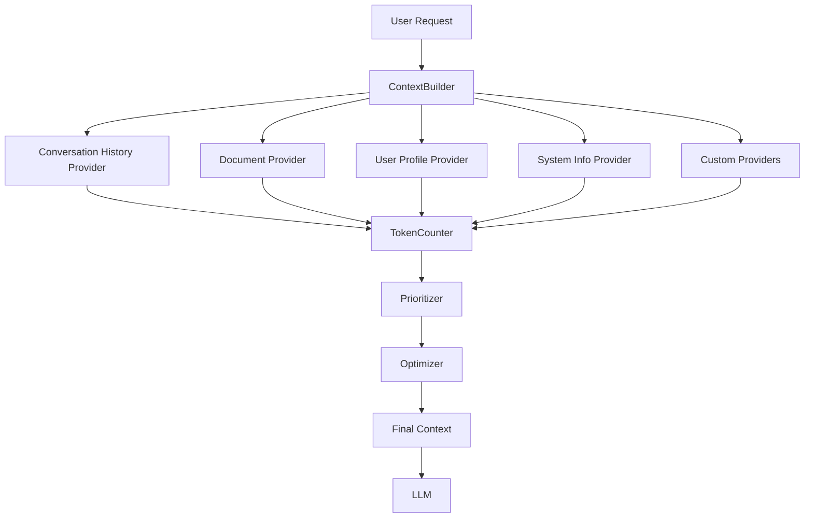

# ContextBuilder Architecture

## Purpose

This handbook document covers the ContextBuilder architecture—the component responsible for assembling context from multiple sources in production AI applications. ContextBuilder is a core module of AI Core that ensures the model receives the right information at the right time.

---

# What is ContextBuilder?

## Definition

ContextBuilder is a component responsible for gathering information from multiple sources and assembling it into a coherent, optimized context for the LLM.

## Core Responsibility

ContextBuilder answers the question: **"What does the model need to know to generate the best possible response?"**

## Analogy

Think of ContextBuilder as a research assistant:
- You ask it a question
- It gathers relevant information from multiple sources
- It organizes and prioritizes the information
- It presents everything in a coherent package
- It respects length/scope constraints

---

# Why ContextBuilder Exists

## The Problem

Every AI application needs context, but:
- Each application assembles context differently
- Context logic gets duplicated across features
- No consistent approach to token budgets
- Context quality varies unpredictably
- Hard to optimize and improve

## The Solution

ContextBuilder provides:
- **Centralized logic**: One implementation, used everywhere
- **Consistent quality**: Same standards across applications
- **Token management**: Enforces budgets automatically
- **Modularity**: Easy to add/remove context sources
- **Reusability**: Shared across AI Core applications

---

# ContextBuilder Responsibilities

## Primary Responsibilities

### 1. Load Conversation History
- Retrieve previous messages
- Apply truncation/summarization
- Maintain conversation flow

### 2. Retrieve Relevant Documents
- Search knowledge bases
- Rank by relevance
- Limit to token budget

### 3. Include User Preferences
- Load user profile
- Apply preferences to context
- Personalize responses

### 4. Add Project Metadata
- Include project-specific information
- Add coding standards
- Include architecture guidelines

### 5. Enforce Context Limits
- Count tokens
- Prioritize information
- Truncate when necessary
- Warn when approaching limits

### 6. Optimize Context Quality
- Remove redundant information
- Deduplicate content
- Summarize when appropriate
- Rank by relevance

---

# ContextBuilder Architecture

## High-Level Design



## Component Breakdown

### 1. ContextBuilder (Orchestrator)
- Coordinates all providers
- Manages token budget
- Makes prioritization decisions
- Returns final context

### 2. Context Providers
- Independent data sources
- Each knows how to fetch its data
- Returns context with token count
- Can be added/removed without affecting others

### 3. Token Counter
- Counts tokens for all context
- Tracks budget usage
- Warns when approaching limits

### 4. Prioritizer
- Ranks context by importance
- Decides what to keep/remove
- Handles trade-offs when over budget

### 5. Optimizer
- Summarizes when needed
- Deduplicates information
- Removes redundancy
- Optimizes for quality

---

# Context Provider Interface

## Standard Interface

Every context provider implements this interface:

```typescript
interface ContextProvider {
  // Unique identifier
  name: string;
  
  // Priority (higher = more important)
  priority: number;
  
  // Fetch context for this request
  build(request: ContextRequest): Promise<ContextResult>;
  
  // Optional: Can this provider be summarized?
  canSummarize: boolean;
  
  // Optional: Maximum tokens this provider can use
  maxTokens?: number;
}

interface ContextResult {
  content: string;
  tokens: number;
  metadata?: Record<string, any>;
}

interface ContextRequest {
  userId: string;
  conversationId: string;
  userMessage: string;
  availableTokens: number;
  existingContext?: string;
}
```

## Example Providers

### 1. Conversation History Provider

```typescript
class ConversationHistoryProvider implements ContextProvider {
  name = 'conversation-history';
  priority = 8; // High priority
  canSummarize = true;
  
  async build(request: ContextRequest): Promise<ContextResult> {
    const messages = await this.getMessages(
      request.conversationId,
      { limit: 50 }
    );
    
    // Keep last 20 messages, summarize the rest
    const recent = messages.slice(-20);
    const older = messages.slice(0, -20);
    
    let content = '';
    
    if (older.length > 0) {
      const summary = await this.summarize(older);
      content += `Previous conversation summary:\n${summary}\n\n`;
    }
    
    content += 'Recent messages:\n';
    content += recent.map(m => `${m.role}: ${m.content}`).join('\n');
    
    const tokens = await this.countTokens(content);
    
    return { content, tokens };
  }
}
```

### 2. Document Provider (RAG)

```typescript
class DocumentProvider implements ContextProvider {
  name = 'documents';
  priority = 7;
  canSummarize = false;
  maxTokens = 20000; // Max 20K tokens for documents
  
  async build(request: ContextRequest): Promise<ContextResult> {
    // Search for relevant documents
    const documents = await this.search(
      request.userMessage,
      { limit: 10, threshold: 0.7 }
    );
    
    // Format documents
    const content = documents.map(doc => {
      return `[${doc.source}]\n${doc.content}\n`;
    }).join('\n');
    
    const tokens = await this.countTokens(content);
    
    return { content, tokens, metadata: { sources: documents.length } };
  }
}
```

### 3. User Profile Provider

```typescript
class UserProfileProvider implements ContextProvider {
  name = 'user-profile';
  priority = 6;
  canSummarize = false;
  
  async build(request: ContextRequest): Promise<ContextResult> {
    const profile = await this.getProfile(request.userId);
    
    const content = `User Profile:
- Skill level: ${profile.skillLevel}
- Preferences: ${profile.preferences.join(', ')}
- Goals: ${profile.goals}
- Language: ${profile.language}`;
    
    const tokens = await this.countTokens(content);
    
    return { content, tokens };
  }
}
```

---

# Context Assembly Process

## Step-by-Step Flow

### Step 1: Initialize Budget

```typescript
const budget = {
  total: 100000, // 100K tokens
  reserved: 4000, // Reserve 4K for response
  available: 96000 // Available for input
};
```

### Step 2: Fetch from All Providers

```typescript
const providers = [
  new SystemPromptProvider(),    // Priority 10
  new UserMessageProvider(),      // Priority 9
  new ConversationHistoryProvider(), // Priority 8
  new DocumentProvider(),         // Priority 7
  new UserProfileProvider()       // Priority 6
];

const results = await Promise.all(
  providers.map(p => p.build(request))
);
```

### Step 3: Sort by Priority

```typescript
results.sort((a, b) => {
  const providerA = providers.find(p => p.name === a.name);
  const providerB = providers.find(p => p.name === b.name);
  return providerB.priority - providerA.priority;
});
```

### Step 4: Fit Within Budget

```typescript
let totalTokens = 0;
let selectedContexts = [];

for (const result of results) {
  if (totalTokens + result.tokens <= budget.available) {
    // Fits in budget
    selectedContexts.push(result);
    totalTokens += result.tokens;
  } else {
    // Doesn't fit - try to optimize
    const remaining = budget.available - totalTokens;
    
    if (result.canSummarize && remaining > 1000) {
      // Summarize to fit
      const summarized = await summarize(result.content, remaining);
      selectedContexts.push(summarized);
      totalTokens += summarized.tokens;
    } else {
      // Skip this provider
      console.warn(`Skipping ${result.name}: insufficient budget`);
    }
  }
}
```

### Step 5: Assemble Final Context

```typescript
const finalContext = selectedContexts
  .map(c => c.content)
  .join('\n\n');

return {
  context: finalContext,
  tokens: totalTokens,
  sources: selectedContexts.map(c => c.name),
  budgetUsed: totalTokens / budget.total
};
```

---

# Token Budget Management

## Budget Allocation Strategy

```
Total Budget: 100K tokens

Fixed (non-negotiable):
- System prompt: 500 tokens (0.5%)
- Current message: 1K tokens (1%)
- Reserved for response: 4K tokens (4%)

Flexible (can be adjusted):
- Conversation history: 20K tokens (20%)
- Retrieved documents: 50K tokens (50%)
- User profile: 2K tokens (2%)
- Custom context: 22.5K tokens (22.5%)

Total: 100K tokens
```

## Dynamic Budget Adjustment

```typescript
class TokenBudgetManager {
  allocate(request: ContextRequest): BudgetAllocation {
    const total = request.contextWindow;
    const reserved = 4000;
    const available = total - reserved;
    
    // Fixed allocations
    const systemPrompt = 500;
    const currentMessage = 1000;
    
    // Remaining for flexible context
    const flexible = available - systemPrompt - currentMessage;
    
    // Allocate based on request type
    if (request.type === 'chat') {
      return {
        systemPrompt,
        currentMessage,
        conversationHistory: flexible * 0.6, // 60% for history
        documents: flexible * 0.3, // 30% for docs
        userProfile: flexible * 0.1 // 10% for profile
      };
    } else if (request.type === 'analysis') {
      return {
        systemPrompt,
        currentMessage,
        documents: flexible * 0.8, // 80% for docs
        conversationHistory: flexible * 0.15,
        userProfile: flexible * 0.05
      };
    }
  }
}
```

---

# Context Optimization Strategies

## Strategy 1: Summarization

When context exceeds budget:

```typescript
async function optimizeContext(
  context: string,
  maxTokens: number
): Promise<string> {
  const currentTokens = await countTokens(context);
  
  if (currentTokens <= maxTokens) {
    return context; // No optimization needed
  }
  
  // Summarize to fit
  const summary = await aiCore.generate({
    prompt: `Summarize the following context in ${maxTokens} tokens or less, 
             preserving all critical information:\n\n${context}`,
    maxTokens: maxTokens
  });
  
  return summary.text;
}
```

## Strategy 2: Truncation

Remove less important information:

```typescript
function truncateContext(
  messages: Message[],
  maxMessages: number
): Message[] {
  if (messages.length <= maxMessages) {
    return messages;
  }
  
  // Keep first message (often contains important context)
  const first = messages[0];
  
  // Keep last N messages
  const last = messages.slice(-maxMessages + 1);
  
  return [first, ...last];
}
```

## Strategy 3: Relevance Filtering

Score and filter context:

```typescript
async function filterByRelevance(
  documents: Document[],
  query: string,
  maxTokens: number
): Promise<Document[]> {
  // Score each document
  const scored = await Promise.all(
    documents.map(async doc => ({
      doc,
      score: await calculateRelevance(doc.content, query)
    }))
  );
  
  // Sort by relevance
  scored.sort((a, b) => b.score - a.score);
  
  // Take top documents until budget
  let tokens = 0;
  const selected = [];
  
  for (const item of scored) {
    if (tokens + item.doc.tokens <= maxTokens) {
      selected.push(item.doc);
      tokens += item.doc.tokens;
    }
  }
  
  return selected;
}
```

---

# ContextBuilder in AI Core

## Module Structure

```
ai-core/src/context/
├── context-builder.ts          # Main orchestrator
├── providers/
│   ├── base/
│   │   └── context-provider.ts # Base interface
│   ├── conversation-history.ts
│   ├── documents.ts
│   ├── user-profile.ts
│   ├── system-info.ts
│   └── custom/
│       └── index.ts
├── optimizer/
│   ├── summarizer.ts
│   ├── deduplicator.ts
│   └── relevance-scorer.ts
├── budget/
│   └── token-budget.ts
└── types/
    └── context.ts
```

## Integration with AI Core

```typescript
// AI Core exposes ContextBuilder
class AICore {
  private contextBuilder: ContextBuilder;
  
  constructor() {
    this.contextBuilder = new ContextBuilder({
      providers: [
        new SystemPromptProvider(),
        new ConversationHistoryProvider(),
        new DocumentProvider(),
        new UserProfileProvider()
      ],
      tokenBudget: 100000,
      reserved: 4000
    });
  }
  
  async generate(request: GenerateRequest): Promise<Response> {
    // Build context
    const context = await this.contextBuilder.build({
      conversationId: request.conversationId,
      userMessage: request.message
    });
    
    // Build prompt
    const prompt = await this.promptBuilder.build({
      template: request.template,
      variables: request.variables
    });
    
    // Combine prompt + context
    const fullRequest = `${prompt}\n\n${context}`;
    
    // Generate response
    return this.provider.generate({
      prompt: fullRequest,
      model: request.model
    });
  }
}
```

---

# Testing ContextBuilder

## Test Scenarios

### 1. Token Budget Tests

```typescript
test('respects token budget', async () => {
  const builder = new ContextBuilder({
    providers: [new LargeDocumentProvider()],
    tokenBudget: 10000
  });
  
  const context = await builder.build(request);
  
  expect(context.tokens).toBeLessThanOrEqual(10000);
});
```

### 2. Prioritization Tests

```typescript
test('includes high-priority context first', async () => {
  const builder = new ContextBuilder({
    providers: [
      new LowPriorityProvider(),
      new HighPriorityProvider()
    ],
    tokenBudget: 100
  });
  
  const context = await builder.build(request);
  
  expect(context.content).toContain('High priority');
  expect(context.content).not.toContain('Low priority');
});
```

### 3. Optimization Tests

```typescript
test('summarizes when over budget', async () => {
  const builder = new ContextBuilder({
    providers: [new SummarizableProvider()],
    tokenBudget: 100
  });
  
  const context = await builder.build(request);
  
  expect(context.tokens).toBeLessThanOrEqual(100);
  expect(context.metadata.summarized).toBe(true);
});
```

---

# Production Considerations

## Monitoring

Track context metrics:

```typescript
interface ContextMetrics {
  totalRequests: number;
  avgTokensPerRequest: number;
  avgProvidersUsed: number;
  budgetUtilization: number;
  summarizationRate: number;
  providerBreakdown: {
    [providerName: string]: {
      used: number;
      skipped: number;
      avgTokens: number;
    }
  };
}
```

## Logging

Log context assembly:

```typescript
console.log('Context assembly:', {
  conversationId: request.conversationId,
  providers: context.sources,
  totalTokens: context.tokens,
  budgetUsed: context.budgetUsed,
  summarized: context.metadata.summarized,
  duration: context.duration
});
```

## Error Handling

```typescript
try {
  const context = await contextBuilder.build(request);
} catch (error) {
  if (error instanceof TokenBudgetExceeded) {
    // Fallback: Use minimal context
    return await buildMinimalContext(request);
  } else if (error instanceof ProviderError) {
    // Fallback: Skip this provider
    return await buildWithoutProvider(request, error.provider);
  } else {
    throw error;
  }
}
```

---

# Common ContextBuilder Mistakes

## ❌ Mistake 1: Monolithic Builder

```typescript
// Bad: One class does everything
class ContextBuilder {
  async build() {
    // 500 lines of mixed logic
  }
}
```

**Fix**: Separate into providers

## ❌ Mistake 2: No Token Management

```typescript
// Bad: Ignores token limits
const context = await buildAllContext();
```

**Fix**: Implement budget management

## ❌ Mistake 3: Context in UI

```typescript
// Bad: UI assembles context
function ChatComponent() {
  const context = [
    ...getHistory(),
    ...getUserProfile(),
    ...getDocuments()
  ];
}
```

**Fix**: Centralize in ContextBuilder

## ❌ Mistake 4: No Prioritization

```typescript
// Bad: Everything or nothing
if (tokens > budget) {
  throw new Error('Too much context');
}
```

**Fix**: Prioritize and truncate intelligently

---

# Interview Questions

## Q: What is ContextBuilder?

**A**: ContextBuilder is a component responsible for assembling context from multiple sources (conversation history, documents, user profile, etc.) into a coherent, optimized context for the LLM. It manages token budgets, prioritizes information, and ensures the model receives the right information.

## Q: What are the main responsibilities of ContextBuilder?

**A**: ContextBuilder loads conversation history, retrieves relevant documents, includes user preferences, adds project metadata, enforces context limits, prioritizes important information, and optimizes context quality through summarization and deduplication.

## Q: Why is ContextBuilder important?

**A**: ContextBuilder centralizes context logic, ensures consistent context quality across applications, manages token budgets automatically, keeps context assembly separate from business logic and UI, and enables optimization and improvement without changing application code.

## Q: How does ContextBuilder handle token limits?

**A**: ContextBuilder implements token budget management: it counts tokens from all providers, sorts by priority, includes high-priority context first, summarizes or truncates when over budget, and warns when approaching limits. It ensures context always fits within the model's context window.

## Q: What's the difference between ContextBuilder and Context Engineering?

**A**: Context Engineering is the discipline and set of principles for managing context. ContextBuilder is the concrete implementation—a component that puts Context Engineering principles into practice. ContextBuilder is the "how," Context Engineering is the "what" and "why."

---

# Assignment

## Objective

Design and implement a ContextBuilder for your AI applications.

## Tasks

1. Design ContextBuilder architecture:
   - Define provider interface
   - Identify needed providers
   - Plan token budget strategy
   - Design prioritization logic

2. Implement 4 providers:
   - Conversation history
   - User profile
   - System information
   - Custom provider (your choice)

3. Add optimization:
   - Token counting
   - Budget management
   - Summarization
   - Truncation

4. Test thoroughly:
   - Token budget tests
   - Provider priority tests
   - Optimization tests
   - Edge cases

## Deliverables

- ContextBuilder architecture design
- 4 working providers
- Token budget manager
- Test suite
- Documentation

---

# Mini Project

## Objective

Build a production-ready ContextBuilder for your AI Chat application.

## Requirements

1. Design modular ContextBuilder:
   - Provider interface
   - At least 5 providers
   - Token budget management
   - Prioritization system

2. Implement providers:
   - Conversation history (with summarization)
   - User profile
   - System information
   - RAG document retrieval
   - Custom provider

3. Add optimization:
   - Relevance scoring
   - Smart truncation
   - Automatic summarization
   - Deduplication

4. Build monitoring:
   - Token usage tracking
   - Provider usage statistics
   - Performance metrics
   - Quality metrics

5. Create comprehensive tests:
   - Unit tests for each provider
   - Integration tests
   - Token budget tests
   - Edge case handling

## Focus

- Building production-grade context assembly
- Understanding token budget management
- Creating maintainable, extensible architecture
- Testing and monitoring

---

# Key Takeaways

- ContextBuilder assembles context from multiple sources
- Centralizes context logic for consistency and reusability
- Manages token budgets automatically
- Prioritizes information by importance
- Optimizes context through summarization and truncation
- Keeps context assembly separate from business logic
- Modular providers enable easy extension
- Monitor and optimize continuously
- ContextBuilder is a core AI Core module

---

# Related Documents

- [Context Engineering](./context-engineering.mdx)
- [Tokens](./../llms/tokens.mdx)
- [Context Window](./../llms/context-window.mdx)
- [RAG and Retrieval](./../rag/retrieval.mdx)
- [AI Core Architecture](../architecture/ai-core.mdx)
- [Roadmap Day 5](../roadmap/day-005-context-engineering/lesson.mdx)