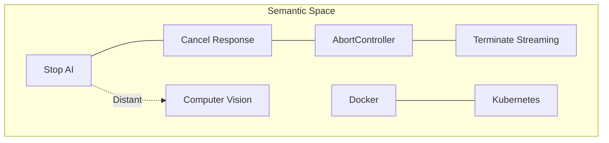
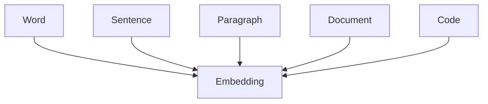

# Embedding Fundamentals

> **Prerequisites**
>
> Before reading this chapter, you should understand:
>
> - Large Language Models
> - Tokens
> - Transformer architecture (high level)
> - Prompt Engineering fundamentals

---

# Purpose

Embeddings are one of the most important concepts in modern AI Engineering.

Although Large Language Models receive most of the attention, production AI systems spend a significant amount of time retrieving information rather than generating text.

Whenever an AI assistant searches documentation, recommends similar products, retrieves company knowledge, finds related code, or identifies similar images, embeddings are usually involved.

This chapter explains **what embeddings are**, **why they exist**, and **how they enable semantic understanding** in AI systems.

Rather than focusing on implementation details alone, we will build an intuitive understanding of embeddings before exploring their role in Retrieval-Augmented Generation (RAG), recommendation systems, and semantic search.

---

# Why This Chapter Matters

Large Language Models have impressive reasoning capabilities, but they have one significant limitation.

They are **not search engines**.

Consider an AI assistant built for your organization.

The company may have:

- millions of documents,
- thousands of API specifications,
- internal architecture diagrams,
- coding standards,
- engineering handbooks,
- customer documentation,
- support tickets.

Even if the LLM was trained on public internet data, it has never seen your organization's private knowledge.

Therefore, before the model can answer a question, the relevant information must first be located.

Finding that information efficiently is a retrieval problem.

Embeddings make semantic retrieval possible.

Without embeddings, most modern AI applications would be limited to exact keyword matching, resulting in poor user experiences and significantly lower answer quality.

---

# Learning Outcomes

After completing this chapter, you should be able to:

- Explain why embeddings exist.
- Differentiate keyword search from semantic search.
- Describe how embeddings represent meaning.
- Explain the concept of vector spaces.
- Understand how embedding models differ from Large Language Models.
- Recognize where embeddings are used in production systems.
- Understand the relationship between embeddings and Retrieval-Augmented Generation.

---

# The Evolution of Information Retrieval

Information retrieval has evolved significantly over the past several decades.

Early search systems relied almost entirely on exact keyword matching.

If the user's query contained the same words as a document, the document was considered relevant.

While effective for structured datasets, this approach struggled whenever people described the same idea using different vocabulary.

For example, consider the following search requests.

| User Query |
|------------|
| Stop AI generation |
| Cancel response |
| Abort streaming |
| Interrupt output |

Although each sentence describes essentially the same intention, the words themselves are different.

A traditional keyword search engine treats these as unrelated queries.

Humans, however, immediately recognize that they all refer to stopping an ongoing AI response.

The gap between **words** and **meaning** is precisely the problem embeddings were designed to solve.

---

# The Search Problem

Imagine that the AI Learning Hub contains hundreds of lessons covering AI Engineering.

One lesson explains how to cancel streaming responses using the JavaScript `AbortController` API.

A learner searches:

> "How do I stop AI generation?"

The lesson never uses the word **stop**.

Instead, it uses terms such as:

- AbortController
- cancel request
- interrupt streaming
- terminate response

A keyword search compares only literal text.

Because the query and the document contain different words, no useful result is returned.

The learner concludes that the documentation is incomplete.

In reality, the information exists—it simply could not be found.

This illustrates the fundamental limitation of lexical search.

---

# Why Keyword Search Fails

Keyword search assumes that identical words imply identical meaning.

Unfortunately, natural language is far more flexible.

The same concept can be expressed using many different words.

Likewise, the same word may have multiple meanings depending on context.

For example:

| Query | Intended Meaning |
|-------|------------------|
| Stop AI | Cancel generation |
| Abort request | Cancel generation |
| Interrupt output | Cancel generation |
| End response | Cancel generation |

A keyword search engine sees four unrelated phrases.

A human sees four ways of expressing the same idea.

Understanding meaning rather than literal wording requires a different representation of language.

This is where embeddings become essential.

---

# From Words to Meaning

Instead of comparing text directly, modern AI systems convert language into numerical representations.

These numerical representations preserve semantic relationships between pieces of text.

Rather than asking:

> **Do these documents contain the same words?**

The system asks:

> **Do these documents express similar ideas?**

This shift—from lexical comparison to semantic comparison—is one of the most significant advancements in information retrieval.

Embeddings provide the mathematical foundation for making this transition possible.

In the next section, we will explore what an embedding actually is and how language can be represented as points within a high-dimensional vector space.
---

# What Is an Embedding?

An **embedding** is a fixed-length numerical representation of data that captures its semantic meaning.

Instead of storing language as words or characters, an embedding model transforms the input into a vector of real numbers.

```
Text

↓

Embedding Model

↓

Vector
```

For example, the sentence

> "How do I stop AI generation?"

may be transformed into a vector similar to:

```text
[
 0.183,
-0.442,
 0.081,
...
1536 values
]
```

Although these numbers appear meaningless to humans, together they describe the semantic characteristics of the sentence.

The values themselves are not important.

What matters is the relationship between vectors.

---

# The Core Idea

Embedding models attempt to answer one fundamental question:

> **Which pieces of information are semantically similar?**

Instead of storing explicit definitions for every possible relationship, they learn mathematical representations where similar concepts naturally appear close together.

Consider the following sentences.

| Sentence |
|-----------|
| Stop AI generation |
| Cancel response |
| Abort streaming |
| Interrupt output |

A human immediately recognizes that these sentences describe the same intent.

An embedding model learns to represent these sentences using vectors that occupy nearby locations in a mathematical space.

This property enables semantic search.

---

# Why Numbers?

Computers cannot reason directly over language.

They perform mathematical operations.

Language therefore needs to be converted into a mathematical representation before similarity can be measured.

Embeddings act as the bridge between:


After conversion, similarity becomes a mathematical problem rather than a linguistic one.

---

# Fixed-Length Representations

One important characteristic of embeddings is that they always have a fixed size.

Whether the input contains:

- one word,
- one sentence,
- one paragraph,
- or an entire document,

the resulting embedding always contains the same number of dimensions.

For example:

| Model | Dimensions |
|---------|-----------:|
| BGE Small | 384 |
| Nomic Embed | 768 |
| text-embedding-3-small | 1536 |
| text-embedding-3-large | 3072 |

This fixed-length representation makes storage, indexing, and similarity calculations efficient.

---

# Embeddings Are Not Encodings

A common misconception is that embeddings simply encode text into numbers.

This is not true.

Consider these examples.

ASCII encoding:

```
A

↓

65
```

Unicode encoding:

```
A

↓

U+0041
```

These encodings preserve identity.

Every occurrence of the letter "A" receives exactly the same value.

Embeddings behave differently.

The vector generated for a word depends on its semantic meaning and context.

For example:

```
Apple
```

may represent:

- the fruit,

or

- Apple Inc.

depending on surrounding text.

Embedding models therefore capture semantics rather than simple symbol mappings.

---

# Understanding Semantic Meaning

Semantic meaning refers to the concepts expressed by language rather than the specific words that are used.

For example:

| Sentence | Same Meaning? |
|-----------|---------------|
| Stop AI generation | ✅ |
| Cancel response | ✅ |
| Abort output | ✅ |
| Interrupt streaming | ✅ |

Although each sentence uses different vocabulary, they communicate nearly the same idea.

Embedding models attempt to preserve these relationships mathematically.

---

# Similar Concepts Form Clusters

Imagine plotting every document in a giant multidimensional space.

Documents discussing similar subjects naturally group together.



Notice that documents discussing response cancellation appear close together.

Topics such as Docker or Computer Vision appear in different regions because they describe unrelated concepts.

This clustering emerges automatically during training.

---

# Semantic Neighborhoods

Every embedding exists within a semantic neighborhood.

Nearby vectors generally describe related ideas.

Examples:

```
Java

↓

Spring Boot

↓

Hibernate

↓

JPA
```

or

```
React

↓

Next.js

↓

TypeScript

↓

Vite
```

Although these technologies are not identical, they frequently appear together in similar contexts.

Embedding models learn these relationships from training data.

---

# Measuring Similarity

Once text has been converted into vectors, similarity can be measured mathematically.

The retrieval pipeline becomes:

```mermaid
flowchart LR

Question

--> Embedding

--> Vector

--> Similarity Search

--> Relevant Documents
```

Notice that the original text is no longer compared.

Instead, the system compares vectors.

This allows the retrieval engine to find documents that express similar ideas, even when they share few or no common words.

---

# Embeddings Are Coordinates

A useful mental model is to think of embeddings as coordinates on a map.

Every city has geographic coordinates.

For example:

| City | Latitude | Longitude |
|------|-----------|------------|
| Pune | ... | ... |
| Mumbai | ... | ... |
| Delhi | ... | ... |

Nearby cities are geographically close.

Embeddings work in a similar way.

Instead of geographic coordinates, they use hundreds or thousands of semantic dimensions.

Nearby vectors represent similar meanings.

The dimensions themselves do not correspond to human concepts.

Instead, they are learned automatically by the embedding model during training.

---

# High-Dimensional Spaces

Humans naturally think in two or three dimensions.

Embedding models operate in hundreds or thousands of dimensions.

For example:

```
384 dimensions

768 dimensions

1536 dimensions

3072 dimensions
```

These dimensions should not be interpreted individually.

Only the overall position of the vector matters.

Just as a GPS coordinate identifies a location on Earth, an embedding identifies a location inside semantic space.

---

# Engineering Insight

An embedding is **not knowledge**.

It is **not reasoning**.

It is **not memory**.

It is **not generated text**.

An embedding is simply a mathematical representation designed to preserve semantic relationships.

Everything that follows—similarity search, clustering, recommendation systems, and Retrieval-Augmented Generation—depends on this representation.

Understanding this distinction is essential before exploring vector similarity and embedding models in the next sections.
---

# From Sparse Representations to Dense Representations

Before modern embedding models existed, Natural Language Processing (NLP) represented text using sparse mathematical vectors.

These representations were simple to construct but failed to capture the meaning of language.

Understanding why sparse representations were replaced helps explain why embeddings became one of the most important building blocks in AI.

---

# One-Hot Encoding

One of the earliest techniques for representing words is **One-Hot Encoding**.

Suppose our vocabulary contains only five words.

| Word | Index |
|------|------:|
| AI | 0 |
| Machine | 1 |
| Learning | 2 |
| Model | 3 |
| Vector | 4 |

Each word is represented by a vector where only one position contains **1** and every other position contains **0**.

| Word | One-Hot Vector |
|------|----------------|
| AI | `[1,0,0,0,0]` |
| Machine | `[0,1,0,0,0]` |
| Learning | `[0,0,1,0,0]` |
| Model | `[0,0,0,1,0]` |
| Vector | `[0,0,0,0,1]` |


Although simple, this representation has a serious limitation.

Every word is equally distant from every other word.

For example,

```
AI
```

is mathematically no closer to

```
Machine
```

than it is to

```
Banana
```

The representation contains **identity**, but no **meaning**.

---

# The Problem with Sparse Vectors

Sparse vectors become increasingly inefficient as vocabulary size grows.

Imagine a vocabulary of one million words.

Each word now requires a vector containing one million dimensions.

Only a single value is non-zero.

```text
[0,0,0,0,0,0,0,1,0,0,0,0,0,...]
```

This leads to several problems:

- Extremely high memory usage
- Computational inefficiency
- No semantic information
- No generalization
- Poor scalability

For production AI systems, sparse representations are impractical.

---

# Dense Embeddings

Embeddings solve these limitations by representing words and sentences using **dense vectors**.

Instead of millions of mostly empty dimensions, embeddings contain a relatively small number of meaningful values.

Example:

```text
[
 0.183,
-0.442,
 0.091,
 0.728,
...
]
```

Every dimension contributes information.

Unlike one-hot vectors, nearby embeddings represent similar meanings.

---

# Sparse vs Dense Representations

| Sparse Representation | Dense Representation |
|-----------------------|----------------------|
| Mostly zeros | Every dimension contains information |
| Very large vectors | Compact vectors |
| Captures identity | Captures semantic meaning |
| Memory intensive | Memory efficient |
| No relationships | Learns relationships |
| Poor scalability | Excellent scalability |

Dense embeddings enable similarity search, clustering, recommendation systems, and Retrieval-Augmented Generation.

---

# Why Dense Vectors Work

Embedding models learn statistical relationships from enormous text corpora.

Words appearing in similar contexts gradually receive similar vector representations.

For example:

```
Doctor
```

often appears near

```
Hospital
Patient
Medicine
Nurse
```

Similarly,

```
React
```

frequently appears alongside

```
Next.js
TypeScript
Component
Hook
```

Because these concepts co-occur in similar contexts, the embedding model places them close together in semantic space.

This principle is often summarized as:

> **Words that appear in similar contexts tend to have similar meanings.**

---

# Distributional Semantics

This idea is known as **Distributional Semantics**.

Rather than storing explicit definitions for every word, embedding models learn meaning from usage patterns.

For example,

```
Java
```

is commonly observed near:

- Spring Boot
- JVM
- Maven
- Hibernate

while

```
Python
```

appears near:

- NumPy
- Pandas
- FastAPI
- PyTorch

The model gradually learns these relationships without anyone manually defining them.

---

# Context Matters

The meaning of language depends heavily on context.

Consider the word:

```
Apple
```

Possible meanings include:

- A fruit
- Apple Inc.
- A grocery item
- A technology company

Modern embedding models generate representations that reflect surrounding context.

For example:

| Sentence | Interpretation |
|----------|----------------|
| I ate an apple after lunch. | Fruit |
| Apple released a new MacBook. | Technology company |

Although the surface word is identical, the semantic representation differs.

This ability to incorporate context is one of the key advantages of modern embedding models.

---

# From Words to Sentences

Early embedding techniques generated vectors for individual words.

Modern embedding models operate at much higher levels.

They can generate embeddings for:

- Words
- Sentences
- Paragraphs
- Source code
- Documentation
- Entire articles



Regardless of the input length, the output is a fixed-dimensional vector.

This consistency simplifies indexing and retrieval.

---

# Embedding Dimensions

Every embedding contains a fixed number of dimensions.

Examples include:

| Model | Dimensions |
|--------|-----------:|
| all-MiniLM-L6-v2 | 384 |
| BGE Small | 384 |
| BGE Base | 768 |
| Nomic Embed | 768 |
| text-embedding-3-small | 1536 |
| text-embedding-3-large | 3072 |

Higher dimensions allow the model to encode richer semantic information.

However, they also increase:

- Storage requirements
- Memory usage
- Index size
- Retrieval latency
- Embedding cost

Choosing an embedding model is therefore an engineering trade-off rather than a simple "bigger is better" decision.

---

# How Embedding Models Learn

Embedding models are trained on massive datasets containing books, websites, technical documentation, conversations, and code.

During training, the model repeatedly predicts relationships between pieces of text.

Over millions or billions of examples, it gradually learns a semantic landscape where related concepts occupy nearby regions.

Importantly, the model is **not memorizing definitions**.

Instead, it learns statistical patterns that reflect how language is used in the real world.

---

# Engineering Perspective

Modern embedding models are specialized neural networks optimized for **representation learning**.

Unlike Large Language Models, their goal is not to generate text.

Instead, they optimize for one objective:

> Place semantically similar inputs close together in vector space while separating unrelated inputs.

Everything else—semantic search, recommendation systems, clustering, duplicate detection, and Retrieval-Augmented Generation—is built on top of this objective.
---

# Popular Embedding Models

The AI ecosystem provides many embedding models, each optimized for different workloads.

Some prioritize retrieval quality, while others focus on latency, multilingual support, or local deployment.

| Model | Dimensions | Strengths | Best For |
|--------|-----------:|-----------|----------|
| all-MiniLM-L6-v2 | 384 | Lightweight, fast | Learning, prototypes |
| BAAI BGE Small | 384 | Excellent retrieval | Production semantic search |
| BAAI BGE Base | 768 | Higher retrieval accuracy | Enterprise knowledge bases |
| Nomic Embed | 768 | Open-source, RAG optimized | Local AI applications |
| E5 Large | 1024 | Multilingual retrieval | Global search systems |
| Jina Embeddings | 1024 | Long-context retrieval | Documentation search |
| Voyage AI | 1024+ | High-quality commercial embeddings | SaaS platforms |
| OpenAI text-embedding-3-small | 1536 | High quality, affordable | Cloud-native applications |
| OpenAI text-embedding-3-large | 3072 | State-of-the-art retrieval | Enterprise AI systems |

Choosing the right model depends on:

- Retrieval accuracy
- Latency requirements
- Infrastructure constraints
- Cost
- Supported languages
- Deployment model (cloud vs local)

Always benchmark using your own dataset rather than selecting a model solely based on benchmark scores.

---

# Embeddings Beyond Text

Although embeddings are commonly associated with text, the same concept applies to many data types.

Modern AI systems generate embeddings for:

- Text
- Source code
- Images
- Audio
- Video
- Graphs
- User behavior

The underlying idea remains the same: represent complex information as vectors while preserving semantic relationships.

This enables multimodal AI systems where different forms of data can be searched and compared within compatible embedding spaces.

---

# Code Embeddings

Modern developer tools rely heavily on code embeddings.

Instead of matching keywords, they understand programming concepts.

For example:

```typescript
const controller = new AbortController();
```

can be retrieved using queries such as:

- "cancel fetch request"
- "stop API call"
- "abort network request"

Although the query and the code share few literal words, they express the same intent.

Tools such as GitHub Copilot, Cursor, and Sourcegraph use embeddings to power semantic code search and contextual code assistance.

---

# Embeddings in Retrieval-Augmented Generation

Embeddings form the retrieval layer of modern RAG systems.

The retrieval workflow is:


Notice that embeddings are generated twice:

1. During document indexing.
2. During query processing.

Both document and query embeddings must be produced using the **same embedding model** to ensure they occupy the same semantic space.

---

# Embeddings in Recommendation Systems

Recommendation engines also use embeddings.

Instead of retrieving documents, they retrieve similar users or products.

Examples include:

- Product recommendations
- Movie recommendations
- Music recommendations
- News feeds
- Social media suggestions

A simplified pipeline looks like:


This allows systems to recommend items based on behavior and preferences rather than exact matches.

---

# Production Best Practices

### Use a Single Embedding Model

Never mix embedding models within the same vector index.

Switching models requires re-indexing all documents.

---

### Chunk Before Embedding

Embedding entire documents usually produces poor retrieval quality.

Instead:

- Split documents into meaningful sections.
- Preserve headings where possible.
- Avoid mixing unrelated topics in a single chunk.

---

### Store Metadata

Every embedding should include metadata such as:

- Document ID
- Chunk ID
- Source file
- Title
- Section
- Tags
- Language
- Last updated

Metadata enables filtering and improves retrieval relevance.

---

### Cache Embeddings

Embedding generation is computationally expensive.

Generate embeddings once during indexing and regenerate only when content changes.

---

### Evaluate Retrieval

Do not evaluate an embedding model solely by benchmark scores.

Measure:

- Precision@K
- Recall@K
- Mean Reciprocal Rank (MRR)
- nDCG
- User satisfaction
- Retrieval latency

Real-world evaluation is the only reliable way to judge retrieval quality.

---

# Performance Considerations

Embedding systems must balance quality with operational efficiency.

Consider:

- Embedding generation time
- Storage requirements
- Vector index size
- Search latency
- Memory usage
- Throughput

Higher-dimensional vectors generally improve representation quality but also increase computational cost.

Benchmark before scaling.

---

# Common Misconceptions

### ❌ Embeddings understand language.

Embeddings represent semantic relationships numerically.

Reasoning remains the responsibility of the Large Language Model.

---

### ❌ Bigger vectors are always better.

Larger vectors require more storage and computation.

A well-trained smaller model may outperform a larger model on a specific domain.

---

### ❌ One embedding per document is enough.

Large documents should be chunked before embedding.

Retrieval quality depends heavily on chunk quality.

---

### ❌ Embeddings replace databases.

Embeddings complement traditional databases.

Use:

- Relational databases for structured data.
- Object storage for files.
- Vector databases for semantic retrieval.

---

# How the AI Learning Hub Uses Embeddings

The AI Learning Hub indexes every lesson, handbook chapter, glossary entry, and project document into a vector database.

```mermaid
flowchart LR

Lesson.mdx --> MarkdownParser

MarkdownParser --> ChunkGenerator

ChunkGenerator --> EmbeddingWorker

EmbeddingWorker --> VectorDatabase

UserQuestion --> QueryEmbedding

QueryEmbedding --> VectorDatabase

VectorDatabase --> Retriever

Retriever --> ContextBuilder

ContextBuilder --> AI Tutor

AI Tutor --> Learner
```

This architecture ensures that responses are grounded in the course content rather than relying solely on the LLM's pre-trained knowledge.

---

# Summary

Embeddings are the foundation of semantic AI systems.

Rather than comparing words directly, they enable computers to compare **meaning**.

Throughout this chapter, we explored:

- Why keyword search is insufficient.
- How embeddings represent semantic information.
- The transition from sparse to dense representations.
- Vector spaces and semantic neighborhoods.
- Popular embedding models.
- Embeddings in RAG, recommendation systems, and semantic search.
- Production best practices.
- Performance considerations.
- Common misconceptions.

These concepts underpin nearly every modern retrieval system and form the basis for the remaining chapters in this handbook.

---

# Key Takeaways

- Embeddings are dense numerical representations of meaning.
- Similar concepts are located close together in vector space.
- Embedding models optimize for representation, not generation.
- Dense vectors outperform sparse representations for semantic retrieval.
- Retrieval-Augmented Generation depends on embeddings for context retrieval.
- Chunk quality and metadata significantly influence retrieval performance.
- Selecting an embedding model is an engineering trade-off involving quality, latency, storage, and cost.

---

# Interview Questions

1. Why are embeddings preferred over keyword search?
2. What is the difference between sparse and dense vectors?
3. Why must query and document embeddings use the same model?
4. How do embeddings enable semantic search?
5. What are the trade-offs of higher-dimensional embeddings?
6. Why is chunking important before embedding?
7. What metadata should accompany embeddings in a production system?
8. How are embeddings used in recommendation systems?

---

# Related Handbook Chapters

- Vector Similarity
- Chunking Strategies
- Production Chunking Pipeline
- Vector Databases
- Vector Database Architecture
- Retrieval-Augmented Generation (Roadmap)
