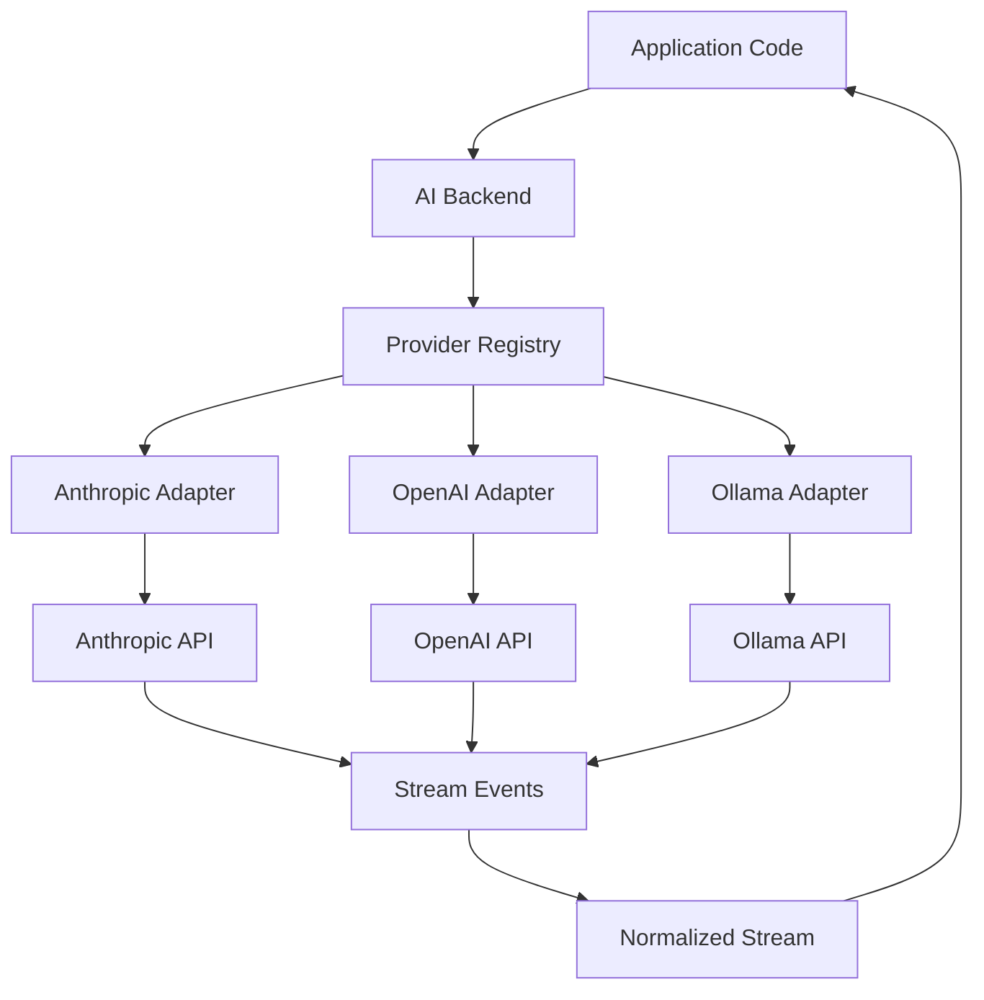

# Provider Abstraction for Streaming

## Purpose

This handbook document covers provider abstraction for streaming—the practice of normalizing different provider streaming APIs into a unified interface. This enables AI applications to work with multiple LLM providers without changing application code.

---

# Why Provider Abstraction Matters for Streaming

## The Problem

Every AI provider streams differently:

### Anthropic
```typescript
for await (const event of stream) {
  // Event types: content_block_start, content_block_delta, content_block_stop
  if (event.type === 'content_block_delta') {
    console.log(event.delta.text);
  }
}
```

### OpenAI
```typescript
for await (const chunk of stream) {
  // Event format: data: {"choices":[{"delta":{"content":"Hello"}}]}
  const content = chunk.choices[0]?.delta?.content || '';
  console.log(content);
}
```

### Ollama
```typescript
for await (const line of stream) {
  // Event format: {"response":"Hello","done":false}
  const data = JSON.parse(line);
  console.log(data.response);
}
```

## The Challenge

If your application code calls provider-specific APIs directly:
- ❌ Tightly coupled to each provider
- ❌ Switching providers requires code changes
- ❌ Duplicate streaming logic across providers
- ❌ Inconsistent error handling
- ❌ Hard to test

## The Solution

Provider abstraction normalizes all providers behind a common interface:

```typescript
// Application code is provider-agnostic
const stream = await aiCore.stream({
  prompt: userMessage,
  provider: 'anthropic' // or 'openai', 'ollama'
});

for await (const chunk of stream) {
  console.log(chunk.text); // Same interface for all providers
}
```

---

# Provider Abstraction Architecture

## High-Level Design



## Component Responsibilities

### 1. Application
- Sends streaming request
- Consumes normalized stream
- No provider-specific code

### 2. Provider Registry
- Selects appropriate provider
- Returns provider instance
- Configuration management

### 3. Provider Adapters
- Wraps provider-specific APIs
- Normalizes events
- Handles provider-specific errors
- Converts to common format

### 4. Normalized Stream
- Common event format
- Consistent interface
- Provider-agnostic

---

# Stream Event Normalization

## Standardized Stream Event

All providers convert to this format:

```typescript
interface StreamEvent {
  id: string;
  type: StreamEventType;
  text: string;
  tokens: number;
  timestamp: Date;
  metadata?: {
    provider: string;
    model: string;
    finishReason?: string;
  };
}

enum StreamEventType {
  TOKEN = 'token',
  DONE = 'done',
  ERROR = 'error',
  METADATA = 'metadata'
}
```

## Event Normalization Examples

### Anthropic → Standard

```typescript
class AnthropicAdapter {
  async *stream(request: StreamRequest): AsyncGenerator<StreamEvent> {
    const stream = await anthropic.messages.stream({
      model: request.model,
      messages: request.messages,
      max_tokens: request.maxTokens
    });
    
    for await (const event of stream) {
      if (event.type === 'content_block_delta') {
        yield {
          id: generateId(),
          type: StreamEventType.TOKEN,
          text: event.delta.text,
          tokens: 1,
          timestamp: new Date(),
          metadata: {
            provider: 'anthropic',
            model: request.model
          }
        };
      }
    }
    
    yield {
      id: generateId(),
      type: StreamEventType.DONE,
      text: '',
      tokens: totalTokens,
      timestamp: new Date(),
      metadata: {
        provider: 'anthropic',
        model: request.model
      }
    };
  }
}
```

### OpenAI → Standard

```typescript
class OpenAIAdapter {
  async *stream(request: StreamRequest): AsyncGenerator<StreamEvent> {
    const stream = await openai.chat.completions.create({
      model: request.model,
      messages: request.messages,
      stream: true
    });
    
    for await (const chunk of stream) {
      const content = chunk.choices[0]?.delta?.content || '';
      
      if (content) {
        yield {
          id: generateId(),
          type: StreamEventType.TOKEN,
          text: content,
          tokens: 1,
          timestamp: new Date(),
          metadata: {
            provider: 'openai',
            model: request.model
          }
        };
      }
    }
    
    yield {
      id: generateId(),
      type: StreamEventType.DONE,
      text: '',
      tokens: totalTokens,
      timestamp: new Date(),
      metadata: {
        provider: 'openai',
        model: request.model
      }
    };
  }
}
```

### Ollama → Standard

```typescript
class OllamaAdapter {
  async *stream(request: StreamRequest): AsyncGenerator<StreamEvent> {
    const response = await fetch('http://localhost:11434/api/generate', {
      method: 'POST',
      body: JSON.stringify({
        model: request.model,
        prompt: request.prompt,
        stream: true
      })
    });
    
    const reader = response.body?.getReader();
    const decoder = new TextDecoder();
    
    while (true) {
      const { done, value } = await reader!.read();
      
      if (done) break;
      
      const text = decoder.decode(value);
      const lines = text.split('\n');
      
      for (const line of lines) {
        if (!line.trim()) continue;
        
        const data = JSON.parse(line);
        
        if (data.response) {
          yield {
            id: generateId(),
            type: StreamEventType.TOKEN,
            text: data.response,
            tokens: 1,
            timestamp: new Date(),
            metadata: {
              provider: 'ollama',
              model: request.model
            }
          };
        }
        
        if (data.done) {
          yield {
            id: generateId(),
            type: StreamEventType.DONE,
            text: '',
            tokens: data.eval_count || 0,
            timestamp: new Date(),
            metadata: {
              provider: 'ollama',
              model: request.model
            }
          };
        }
      }
    }
  }
}
```

---

# Provider Registry

## Implementation

```typescript
interface Provider {
  name: string;
  stream(request: StreamRequest): AsyncGenerator<StreamEvent>;
  generate(request: GenerateRequest): Promise<GenerateResponse>;
}

class ProviderRegistry {
  private providers: Map<string, Provider> = new Map();
  
  register(provider: Provider) {
    this.providers.set(provider.name, provider);
  }
  
  get(name: string): Provider {
    const provider = this.providers.get(name);
    
    if (!provider) {
      throw new Error(`Provider not found: ${name}`);
    }
    
    return provider;
  }
  
  list(): string[] {
    return Array.from(this.providers.keys());
  }
}

// Usage
const registry = new ProviderRegistry();

registry.register(new AnthropicAdapter());
registry.register(new OpenAIAdapter());
registry.register(new OllamaAdapter());

// Application uses registry
const provider = registry.get('anthropic');
const stream = provider.stream(request);

for await (const event of stream) {
  console.log(event.text);
}
```

---

# Stream Normalization in AI Core

## AI Core Integration

```typescript
class AICore {
  private providerRegistry: ProviderRegistry;
  
  constructor() {
    this.providerRegistry = new ProviderRegistry();
    
    // Register providers
    this.providerRegistry.register(new AnthropicAdapter());
    this.providerRegistry.register(new OpenAIAdapter());
    this.providerRegistry.register(new OllamaAdapter());
  }
  
  async *stream(request: StreamRequest): AsyncGenerator<StreamEvent> {
    // Get provider
    const provider = this.providerRegistry.get(request.provider);
    
    // Stream from provider
    for await (const event of provider.stream(request)) {
      // Can add cross-cutting concerns here:
      // - Logging
      // - Metrics
      // - Token counting
      // - Error handling
      
      yield event;
    }
  }
}
```

## Backend Integration

```typescript
// AI Backend uses AI Core
app.post('/api/chat/stream', async (req, res) => {
  // Set SSE headers
  res.setHeader('Content-Type', 'text/event-stream');
  res.setHeader('Cache-Control', 'no-cache');
  
  try {
    // Stream from AI Core (provider-agnostic)
    const stream = await aiCore.stream({
      prompt: req.body.prompt,
      provider: req.body.provider || 'anthropic',
      model: req.body.model
    });
    
    // Send normalized events to frontend
    for await (const event of stream) {
      res.write(`data: ${JSON.stringify(event)}\n\n`);
      res.flush();
    }
    
    res.end();
    
  } catch (error) {
    res.write(`data: ${JSON.stringify({
      type: 'error',
      message: error.message
    })}\n\n`);
    res.end();
  }
});
```

---

# Provider-Specific Considerations

## Anthropic

### Event Types
- `message_start`: Message begins
- `content_block_start`: Content block begins
- `content_block_delta`: Token delta
- `content_block_stop`: Content block ends
- `message_delta`: Message metadata
- `message_stop`: Message ends

### Special Handling
```typescript
if (event.type === 'content_block_delta') {
  yield normalizeToken(event.delta.text);
}
```

## OpenAI

### Event Format
```json
{
  "id": "chatcmpl-123",
  "object": "chat.completion.chunk",
  "created": 1677652288,
  "model": "gpt-4",
  "choices": [{
    "index": 0,
    "delta": {
      "content": "Hello"
    },
    "finish_reason": null
  }]
}
```

### Special Handling
```typescript
const content = chunk.choices[0]?.delta?.content || '';
if (content) {
  yield normalizeToken(content);
}
```

## Ollama

### Event Format
```json
{
  "model": "llama3.2",
  "response": "Hello",
  "done": false
}
```

### Special Handling
```typescript
if (data.response) {
  yield normalizeToken(data.response);
}

if (data.done) {
  yield normalizeDone(data.eval_count);
}
```

---

# Error Handling Across Providers

## Standardized Errors

```typescript
interface StreamError {
  code: ErrorCode;
  message: string;
  provider: string;
  retryable: boolean;
  originalError?: any;
}

enum ErrorCode {
  RATE_LIMIT = 'RATE_LIMIT',
  INVALID_REQUEST = 'INVALID_REQUEST',
  PROVIDER_ERROR = 'PROVIDER_ERROR',
  NETWORK_ERROR = 'NETWORK_ERROR',
  TIMEOUT = 'TIMEOUT'
}
```

## Error Normalization

```typescript
class AnthropicAdapter {
  async *stream(request: StreamRequest): AsyncGenerator<StreamEvent> {
    try {
      // Stream logic
    } catch (error) {
      yield {
        id: generateId(),
        type: StreamEventType.ERROR,
        text: '',
        tokens: 0,
        timestamp: new Date(),
        metadata: {
          provider: 'anthropic',
          error: this.normalizeError(error)
        }
      };
    }
  }
  
  private normalizeError(error: any): StreamError {
    if (error.status === 429) {
      return {
        code: ErrorCode.RATE_LIMIT,
        message: 'Rate limit exceeded',
        provider: 'anthropic',
        retryable: true,
        originalError: error
      };
    }
    
    return {
      code: ErrorCode.PROVIDER_ERROR,
      message: error.message,
      provider: 'anthropic',
      retryable: false,
      originalError: error
    };
  }
}
```

---

# Testing Provider Abstraction

## Interface Contract Tests

```typescript
interface ProviderTestSuite {
  name: string;
  testStream(request: StreamRequest): Promise<void>;
  testErrorHandling(): Promise<void>;
  testNormalization(): Promise<void>;
}

class AnthropicAdapterTest implements ProviderTestSuite {
  name = 'Anthropic Adapter';
  
  async testStream(request: StreamRequest) {
    const adapter = new AnthropicAdapter();
    const stream = adapter.stream(request);
    
    const events: StreamEvent[] = [];
    
    for await (const event of stream) {
      events.push(event);
    }
    
    // Assertions
    expect(events.length).toBeGreaterThan(0);
    expect(events[0].type).toBe(StreamEventType.TOKEN);
    expect(events[events.length - 1].type).toBe(StreamEventType.DONE);
    expect(events[0].metadata?.provider).toBe('anthropic');
  }
  
  async testErrorHandling() {
    // Test error scenarios
  }
  
  async testNormalization() {
    // Test event normalization
  }
}
```

## Cross-Provider Consistency Tests

```typescript
test('all providers produce same event structure', async () => {
  const providers = [
    new AnthropicAdapter(),
    new OpenAIAdapter(),
    new OllamaAdapter()
  ];
  
  for (const provider of providers) {
    const stream = provider.stream(testRequest);
    const events = await collectEvents(stream);
    
    // All events should have same structure
    for (const event of events) {
      expect(event).toHaveProperty('id');
      expect(event).toHaveProperty('type');
      expect(event).toHaveProperty('text');
      expect(event).toHaveProperty('tokens');
      expect(event).toHaveProperty('timestamp');
      expect(event).toHaveProperty('metadata');
    }
  }
});
```

---

# Provider Abstraction Best Practices

## 1. Consistent Interface

All providers should expose the same interface:

```typescript
interface Provider {
  stream(request: StreamRequest): AsyncGenerator<StreamEvent>;
  generate(request: GenerateRequest): Promise<GenerateResponse>;
}
```

## 2. Fail Fast

Validate provider availability:

```typescript
const provider = registry.get(request.provider);

if (!provider.isAvailable()) {
  throw new Error(`Provider ${request.provider} is not available`);
}
```

## 3. Graceful Degradation

```typescript
try {
  const stream = await primaryProvider.stream(request);
  return stream;
} catch (error) {
  // Fallback to secondary provider
  const stream = await fallbackProvider.stream(request);
  return stream;
}
```

## 4. Provider Health Checks

```typescript
class ProviderRegistry {
  async healthCheck(providerName: string): Promise<boolean> {
    const provider = this.providers.get(providerName);
    
    try {
      await provider.healthCheck();
      return true;
    } catch (error) {
      return false;
    }
  }
  
  async getHealthyProvider(): Promise<Provider> {
    for (const [name, provider] of this.providers) {
      const healthy = await this.healthCheck(name);
      
      if (healthy) {
        return provider;
      }
    }
    
    throw new Error('No healthy providers available');
  }
}
```

---

# Advanced Provider Abstraction

## Multi-Provider Streaming

Stream from multiple providers simultaneously:

```typescript
async function *multiProviderStream(
  providers: string[],
  request: StreamRequest
): AsyncGenerator<StreamEvent> {
  const streams = providers.map(name => {
    const provider = registry.get(name);
    return provider.stream(request);
  });
  
  // Merge streams
  const merged = mergeStreams(streams);
  
  for await (const event of merged) {
    yield event;
  }
}
```

## Provider Routing

Intelligent provider selection:

```typescript
class ProviderRouter {
  route(request: Request): Provider {
    // Route based on request characteristics
    if (request.priority === 'speed') {
      return registry.get('anthropic'); // Haiku
    } else if (request.priority === 'quality') {
      return registry.get('anthropic'); // Opus
    } else if (request.costSensitive) {
      return registry.get('ollama'); // Local
    }
    
    // Default
    return registry.get('anthropic');
  }
}
```

## A/B Testing Providers

```typescript
class ABTestProvider implements Provider {
  constructor(
    private providerA: Provider,
    private providerB: Provider,
    private split: number = 0.5
  ) {}
  
  async *stream(request: StreamRequest): AsyncGenerator<StreamEvent> {
    const useProviderB = Math.random() < this.split;
    const provider = useProviderB ? this.providerB : this.providerA;
    
    // Log which provider was used
    console.log(`Using provider: ${provider.name}`);
    
    for await (const event of provider.stream(request)) {
      yield event;
    }
  }
}
```

---

# Interview Questions

## Q: What is provider abstraction?

**A**: Provider abstraction is the practice of wrapping different provider-specific APIs behind a common interface. This allows application code to work with multiple providers (Anthropic, OpenAI, Ollama, etc.) without changing the application logic when switching providers.

## Q: Why is provider abstraction important for streaming?

**A**: Every provider streams differently (different event formats, different APIs, different error handling). Provider abstraction normalizes these differences into a common interface, enabling applications to switch providers without code changes and maintain consistent behavior across providers.

## Q: What is stream normalization?

**A**: Stream normalization is the process of converting provider-specific stream events into a standard format. For example, Anthropic's `content_block_delta` events, OpenAI's `choices[0].delta.content`, and Ollama's `response` fields are all normalized to a common `StreamEvent` interface with `text`, `tokens`, `type`, etc.

## Q: How do you handle provider-specific errors?

**A**: Each provider adapter catches provider-specific errors and normalizes them into a standard error format with error code, message, retryability, and provider name. This allows application code to handle errors consistently regardless of which provider failed.

## Q: What are the benefits of provider abstraction?

**A**: Benefits include: provider independence (switch providers without code changes), consistent behavior (same interface across providers), easier testing (mock the interface), reduced duplication (one streaming implementation), and flexibility (add new providers without changing application code).

---

# Assignment

## Objective

Implement provider abstraction for streaming.

## Tasks

1. Design standard StreamEvent interface
2. Implement adapters for:
   - Anthropic
   - OpenAI
   - Ollama
3. Create ProviderRegistry
4. Normalize events from each provider
5. Handle errors consistently
6. Test with all providers

## Deliverables

- StreamEvent interface
- 3 provider adapters
- ProviderRegistry
- Normalization logic
- Error handling
- Test suite

---

# Mini Project

## Objective

Build production-ready provider abstraction for your AI platform.

## Requirements

1. Design provider abstraction layer:
   - Standard StreamEvent interface
   - Provider interface
   - ProviderRegistry

2. Implement adapters:
   - Anthropic adapter
   - OpenAI adapter
   - Ollama adapter
   - At least one additional provider

3. Add features:
   - Event normalization
   - Error normalization
   - Health checks
   - Fallback providers

4. Build testing:
   - Interface contract tests
   - Cross-provider consistency tests
   - Error handling tests
   - Integration tests

5. Create documentation:
   - Provider capabilities
   - Event formats
   - Error codes
   - Usage examples

## Focus

- Understanding provider differences
- Building robust abstraction layer
- Normalizing diverse APIs
- Production-ready error handling

---

# Key Takeaways

- Provider abstraction enables provider independence
- Every provider streams differently
- Normalize to standard StreamEvent format
- Keep application code provider-agnostic
- Handle provider-specific errors consistently
- ProviderRegistry manages provider selection
- Adapters wrap provider-specific APIs
- Test interface contracts across providers
- Enable easy provider switching
- Foundation for multi-provider strategies

---

# Related Documents

- [Streaming Basics](./streaming-basics.mdx)
- [SSE](./sse.mdx)
- [ReadableStream](./readable-stream.mdx)
- [Provider Adapters Architecture](../architecture/provider-adapters.mdx)
- [AI Core Architecture](../architecture/ai-core.mdx)
- [Roadmap Day 7](../roadmap/day-007-production-streaming-architecture/lesson.mdx)