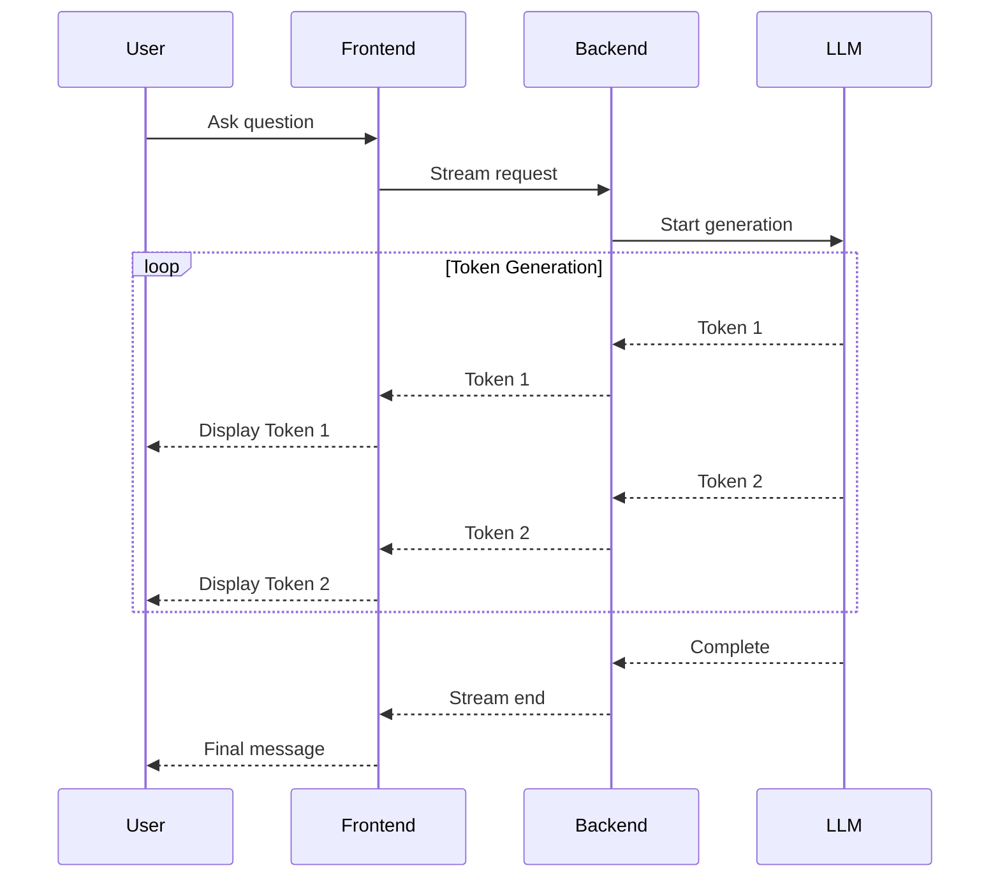

# Streaming Fundamentals

## Purpose

This handbook document covers streaming fundamentals—the foundation of modern AI application user experience. Streaming enables applications to display AI responses incrementally as they are generated, rather than waiting for complete responses.

---

# What is Streaming?

## Definition

Streaming is the practice of sending data incrementally as it becomes available, rather than waiting for the complete response.

## In AI Applications

Instead of waiting 5-10 seconds for a complete AI response, streaming displays tokens (words/phrases) as they are generated:

```
Without streaming:
User asks question → [wait 5 seconds] → Full response appears

With streaming:
User asks question → Token 1 → Token 2 → Token 3 → ... → Complete
                      (immediate)  (0.1s)      (0.2s)
```

## Core Concept

LLMs generate text one token at a time. Streaming simply exposes these intermediate tokens to the application as they are produced.

---

# Why Streaming Matters

## User Experience

### Without Streaming
- **Wait time**: User sees nothing for 3-10 seconds
- **Uncertainty**: User doesn't know if app is working
- **Frustration**: Feels slow and unresponsive
- **Abandonment**: Users may leave before response appears

### With Streaming
- **Immediate feedback**: First token appears in 0.2-0.5 seconds
- **Progress indication**: User sees response building
- **Engagement**: Feels interactive and responsive
- **Confidence**: User knows the app is working

## Perceived Performance

Streaming improves **perceived performance** even though total generation time may be the same:

```
Scenario: 5-second response generation

Without streaming:
0s ────────────────── 5s ─── Response appears
(blank screen, user waits)

With streaming:
0s ── T ──o ──k ──e ──n ──1 ── ... ── Complete
(0.2s) (0.3s) (0.4s) (0.5s) (0.6s)

Perceived speed: Much faster!
```

## Real-World Examples

### ChatGPT
- Streams responses token by token
- Typing indicator shows generation in progress
- User can stop generation at any point

### Claude
- Similar streaming behavior
- Smooth, natural text appearance
- Stop generation support

### GitHub Copilot
- Streams code suggestions
- Shows partial code immediately
- User can accept or reject

---

# How LLMs Generate Text

## Token-by-Token Generation

LLMs don't generate entire responses at once. They predict one token at a time:

```
Step 1: Input prompt
"The capital of France is"

Step 2: Model predicts next token
" Paris" (highest probability)

Step 3: Append to input
"The capital of France is Paris"

Step 4: Repeat
"The capital of France is Paris" → "."

Step 5: Continue until stop condition
"The capital of France is Paris."
```

## Generation Process

```
Prompt
  ↓
Token 1 (0.2s)
  ↓
Token 2 (0.1s)
  ↓
Token 3 (0.1s)
  ↓
Token 4 (0.1s)
  ↓
...
  ↓
Completed Response (5s total)
```

Each token takes 0.1-0.3 seconds to generate.

## Why Not Generate All at Once?

LLMs are autoregressive:
- Each token depends on previous tokens
- Must generate sequentially
- Cannot parallelize token generation
- Streaming is natural byproduct of architecture

---

# Streaming Architecture

## High-Level Flow



## Layer Responsibilities

### Frontend
- Read streamed data
- Update UI incrementally
- Render Markdown
- Display typing indicators
- Handle cancellation
- Preserve partial output

### Backend
- Call AI provider
- Stream provider response
- Normalize events
- Handle errors
- Manage connections

### LLM Provider
- Generate tokens
- Stream events
- Respect stop conditions
- Provide metadata

---

# Streaming Use Cases

## 1. AI Chat Applications

```
User: "Explain quantum computing"

Streaming response:
"Quantum" → "computing" → "is" → "a" → "type" → "of" → "computation" → ...
```

**Benefit**: Natural conversational experience

## 2. Code Generation

```
Request: "Write a React hook for fetching data"

Streaming output:
"import" → "{" → "useState" → "}" → "from" → "'react'" → ";" → ...
```

**Benefit**: User sees code immediately, can stop if wrong direction

## 3. Document Drafting

```
Request: "Write a blog post about AI"

Streaming output:
"Artificial" → "Intelligence" → "has" → "become" → "a" → "transformative" → ...
```

**Benefit**: User can start reading while still generating

## 4. Translation

```
Request: "Translate to Spanish: Hello world"

Streaming output:
""Hola" → "mundo" → ""
```

**Benefit**: Fast feedback for short translations

## 5. Summarization

```
Request: "Summarize this 10-page document"

Streaming output:
"This" → "document" → "discusses" → "three" → "main" → "points" → ...
```

**Benefit**: User sees summary structure immediately

---

# Streaming Benefits

## 1. Better Perceived Performance

- First token in 0.2-0.5 seconds
- User sees immediate progress
- Feels responsive even if total time is same

## 2. Progressive Rendering

- Display content as it arrives
- User can start reading immediately
- Better engagement

## 3. Early User Feedback

- User can stop if response is wrong direction
- Saves tokens and time
- Better user control

## 4. Reduced Frustration

- No "is it working?" uncertainty
- Visual confirmation of progress
- Professional user experience

## 5. Improved Conversational Experience

- More natural interaction
- Feels like talking to a person
- Better for chat applications

## 6. Ability to Interrupt

- Stop generation at any point
- Don't waste tokens on unwanted responses
- User has control

---

# Streaming Challenges

## 1. Partial Responses

**Problem**: Response is incomplete if user navigates away

**Solution**: Preserve partial output, allow continuation

## 2. Connection Interruptions

**Problem**: Network drops mid-stream

**Solution**: Retry logic, resume from last token

## 3. Error Handling

**Problem**: Error occurs after partial output

**Solution**: Display partial output + error message, allow retry

## 4. UI Synchronization

**Problem**: Tokens arrive faster than UI can render

**Solution**: Buffer management, requestAnimationFrame

## 5. Cancellation

**Problem**: User stops generation, but model continues

**Solution**: AbortController, cleanup on unmount

## 6. Buffer Management

**Problem**: Incomplete chunks arrive

**Solution**: Buffer incomplete data, parse complete events

## 7. Token Accounting

**Problem**: Hard to track tokens in streaming

**Solution**: Count tokens as they arrive, track in real-time

---

# Streaming vs Non-Streaming

## Comparison

| Aspect | Non-Streaming | Streaming |
|--------|---------------|-----------|
| Time to first token | Full response time | 0.2-0.5s |
| User feedback | None until complete | Continuous |
| Perceived speed | Slow | Fast |
| Interruption | Not possible | Easy |
| Implementation | Simple | More complex |
| Error handling | Simple | Complex |
| UI updates | One update | Many updates |
| Memory usage | Lower | Higher (buffers) |

## When to Use Each

### Use Streaming
✅ AI chat applications
✅ Long-form content generation
✅ Code generation
✅ Interactive experiences
✅ User-facing applications

### Non-Streaming Acceptable
❌ Batch processing
❌ Background jobs
❌ API-to-API communication
❌ Simple one-off requests

---

# Streaming in Our Projects

## AI Chat Application

```
User sends message
    ↓
Stream request to backend
    ↓
Display tokens as they arrive
    ↓
User sees response building
    ↓
User can stop at any time
    ↓
Complete message saved to history
```

## AI Learning Portal

```
Student asks question
    ↓
AI Tutor streams explanation
    ↓
Student can stop if understood
    ↓
Continue generation if needed
    ↓
Save interaction to progress
```

## PR Reviewer

```
Developer requests review
    ↓
Stream review as it generates
    ↓
Show issues as they're found
    ↓
Developer can stop if satisfied
    ↓
Complete review saved
```

---

# Streaming State Management

## Message States

```typescript
enum MessageStatus {
  IDLE = 'idle',           // Not started
  STREAMING = 'streaming', // Generating
  COMPLETED = 'completed', // Done
  STOPPED = 'stopped',     // User stopped
  ERROR = 'error'          // Failed
}
```

## State Transitions

```
IDLE → STREAMING (user sends message)
STREAMING → COMPLETED (generation finishes)
STREAMING → STOPPED (user stops)
STREAMING → ERROR (error occurs)
STREAMED → STREAMING (user continues)
```

## State Management Example

```typescript
interface Message {
  id: string;
  role: 'user' | 'assistant';
  content: string;
  status: MessageStatus;
  tokens: number;
  timestamp: Date;
}

function useChat() {
  const [messages, setMessages] = useState<Message[]>([]);
  const [currentMessage, setCurrentMessage] = useState<Message | null>(null);
  
  const sendMessage = async (content: string) => {
    // Add user message
    const userMessage: Message = {
      id: generateId(),
      role: 'user',
      content,
      status: MessageStatus.COMPLETED,
      tokens: countTokens(content),
      timestamp: new Date()
    };
    
    setMessages(prev => [...prev, userMessage]);
    
    // Create assistant message (streaming)
    const assistantMessage: Message = {
      id: generateId(),
      role: 'assistant',
      content: '',
      status: MessageStatus.STREAMING,
      tokens: 0,
      timestamp: new Date()
    };
    
    setCurrentMessage(assistantMessage);
    
    // Stream response
    try {
      const stream = await aiCore.stream({
        message: content,
        conversationId: conversationId
      });
      
      for await (const chunk of stream) {
        setCurrentMessage(prev => ({
          ...prev,
          content: prev.content + chunk.text,
          tokens: prev.tokens + chunk.tokens
        }));
      }
      
      // Mark complete
      setCurrentMessage(prev => ({
        ...prev,
        status: MessageStatus.COMPLETED
      }));
      
      setMessages(prev => [...prev, assistantMessage]);
    } catch (error) {
      setCurrentMessage(prev => ({
        ...prev,
        status: MessageStatus.ERROR
      }));
    }
  };
  
  const stopGeneration = () => {
    setCurrentMessage(prev => ({
      ...prev,
      status: MessageStatus.STOPPED
    }));
    // Abort the stream
    abortController.abort();
  };
}
```

---

# Streaming UX Best Practices

## 1. Show Typing Indicator

Before first token arrives:
```
AI is thinking...
[Animation: • • •]
```

## 2. Display Tokens Immediately

Don't wait for complete words:
```
✅ Good: "Q-u-a-n-t-u-m" (appears gradually)
❌ Bad: Wait for "Quantum" then show it
```

## 3. Smooth Rendering

Use requestAnimationFrame:
```typescript
let pendingTokens = '';
let renderScheduled = false;

function onTokenReceived(token: string) {
  pendingTokens += token;
  
  if (!renderScheduled) {
    renderScheduled = true;
    requestAnimationFrame(() => {
      updateUI(pendingTokens);
      pendingTokens = '';
      renderScheduled = false;
    });
  }
}
```

## 4. Auto-Scroll

Keep latest content visible:
```typescript
useEffect(() => {
  if (autoScroll) {
    messagesEndRef.current?.scrollIntoView({ behavior: 'smooth' });
  }
}, [currentMessage.content]);
```

## 5. Stop Button

Always provide way to stop:
```
[Stop Generation] button
Visible during streaming
Hidden when complete
```

## 6. Preserve Partial Output

Never discard partial responses:
```
User stops at "Quantum comp"
Show: "Quantum comp" (not empty!)
Allow: Continue generation
```

## 7. Error Recovery

If stream fails:
```
Show partial output
Show error message
[Retry] button
[Continue] button
```

---

# Streaming Performance

## Metrics to Track

### Time to First Token (TTFT)
- Time from request to first token
- Target: < 0.5 seconds
- Critical for perceived performance

### Tokens Per Second (TPS)
- How fast tokens arrive
- Target: 20-50 tokens/second
- Varies by model and provider

### Total Generation Time
- Time to complete response
- Depends on response length
- Not as critical as TTFT

### Stream Duration
- Total time streaming
- Includes network latency
- Should be smooth, no gaps

## Optimization

### Reduce TTFT
- Use faster models (Haiku, Flash)
- Optimize prompt size
- Cache common requests
- Use edge locations

### Smooth Streaming
- Buffer management
- Request animation frames
- Avoid UI jank
- Pre-render Markdown

---

# Streaming Implementation Patterns

## Pattern 1: Async Iterator

```typescript
async function* streamResponse(prompt: string) {
  const response = await fetch('/api/chat', {
    method: 'POST',
    body: JSON.stringify({ prompt })
  });
  
  const reader = response.body?.getReader();
  const decoder = new TextDecoder();
  
  while (true) {
    const { done, value } = await reader!.read();
    
    if (done) break;
    
    const text = decoder.decode(value);
    const tokens = parseTokens(text);
    
    for (const token of tokens) {
      yield token;
    }
  }
}

// Usage
for await (const token of streamResponse(prompt)) {
  updateUI(token);
}
```

## Pattern 2: Event-Based

```typescript
const eventSource = new EventSource('/api/chat?prompt=' + prompt);

eventSource.onmessage = (event) => {
  const token = JSON.parse(event.data);
  updateUI(token);
};

eventSource.onend = () => {
  eventSource.close();
  markComplete();
};

eventSource.onerror = () => {
  eventSource.close();
  markError();
};
```

## Pattern 3: Callback-Based

```typescript
function streamResponse(prompt: string, callbacks: {
  onToken: (token: string) => void;
  onComplete: () => void;
  onError: (error: Error) => void;
}) {
  fetch('/api/chat', {
    method: 'POST',
    body: JSON.stringify({ prompt })
  })
  .then(response => response.body?.getReader())
  .then(reader => {
    const decoder = new TextDecoder();
    
    function read() {
      return reader.read().then(({ done, value }) => {
        if (done) {
          callbacks.onComplete();
          return;
        }
        
        const text = decoder.decode(value);
        const tokens = parseTokens(text);
        
        tokens.forEach(token => callbacks.onToken(token));
        
        return read();
      });
    }
    
    return read();
  })
  .catch(callbacks.onError);
}
```

---

# Interview Questions

## Q: What is streaming in AI applications?

**A**: Streaming is the practice of sending data incrementally as it becomes available. In AI applications, it means displaying the model's response token by token as it's generated, rather than waiting for the complete response.

## Q: Why is streaming important for AI applications?

**A**: Streaming improves user experience by providing immediate feedback, reducing perceived wait time, enabling progressive rendering, allowing users to stop generation, and creating a more natural conversational experience. It makes applications feel responsive even when total generation time is the same.

## Q: How do LLMs generate text?

**A**: LLMs generate text one token at a time (autoregressive generation). Given an input sequence, they predict the most likely next token, append it to the input, and repeat until a stopping condition is met. Streaming simply exposes these intermediate tokens as they're produced.

## Q: What are the challenges of streaming?

**A**: Challenges include: partial responses (incomplete if user navigates away), connection interruptions, error handling after partial output, UI synchronization (tokens arrive faster than UI can render), cancellation (stopping generation cleanly), buffer management (incomplete chunks), and token accounting (counting in real-time).

## Q: What metrics matter for streaming?

**A**: Key metrics are: Time to First Token (TTFT - target < 0.5s), Tokens Per Second (TPS - target 20-50), total generation time, and stream smoothness (no gaps or jank). TTFT is most critical for perceived performance.

---

# Assignment

## Objective

Understand streaming by observing and analyzing real AI applications.

## Tasks

1. Use three AI products that support streaming:
   - ChatGPT
   - Claude
   - GitHub Copilot Chat

2. For each, measure and document:
   - Time to first token (estimate)
   - Rendering behavior (smooth, jerky, word-by-word, character-by-character)
   - Typing indicators
   - Loading states
   - Stop generation support
   - Error handling

3. Compare and contrast:
   - Which has best streaming UX?
   - What makes it better?
   - What could be improved?

4. Implement a simple streaming demo:
   - Connect to Ollama API
   - Stream response to UI
   - Add stop button
   - Handle errors

## Deliverables

- Analysis of 3 AI products
- Comparison table
- Working streaming demo
- Screenshots/videos

---

# Mini Project

## Objective

Add streaming support to your AI Chat application.

## Requirements

1. Implement streaming architecture:
   - Backend streaming endpoint
   - Frontend stream reader
   - Token-by-token rendering
   - State management

2. Add UX features:
   - Typing indicator
   - Stop generation button
   - Auto-scroll
   - Markdown rendering
   - Error handling

3. Optimize performance:
   - Smooth rendering
   - Buffer management
   - Request animation frames
   - Minimal re-renders

4. Test thoroughly:
   - Fast connections
   - Slow connections
   - Interruptions
   - Errors
   - Edge cases

## Focus

- Understanding streaming fundamentals
- Building production-ready streaming UX
- Handling real-world streaming challenges

---

# Key Takeaways

- Streaming displays AI responses incrementally as generated
- Dramatically improves perceived performance
- LLMs naturally generate token by token
- Streaming exposes this natural behavior
- Critical for good AI application UX
- Enables user control (stop generation)
- More complex than non-streaming but worth it
- Time to first token is most important metric
- Always preserve partial output
- Handle errors gracefully

---

# Related Documents

- [SSE and Server-Sent Events](handbook.streaming.sse)
- [ReadableStream](handbook.streaming.readable-stream)
- [Provider Abstraction](handbook.streaming.provider-abstraction)
- [AI Chat Architecture](../architecture/ai-chat.mdx)
- [Roadmap Day 6](roadmap.day-006-streaming-fundamentals.lesson)
- [Roadmap Day 7](roadmap.day-007-production-streaming-architecture.lesson)