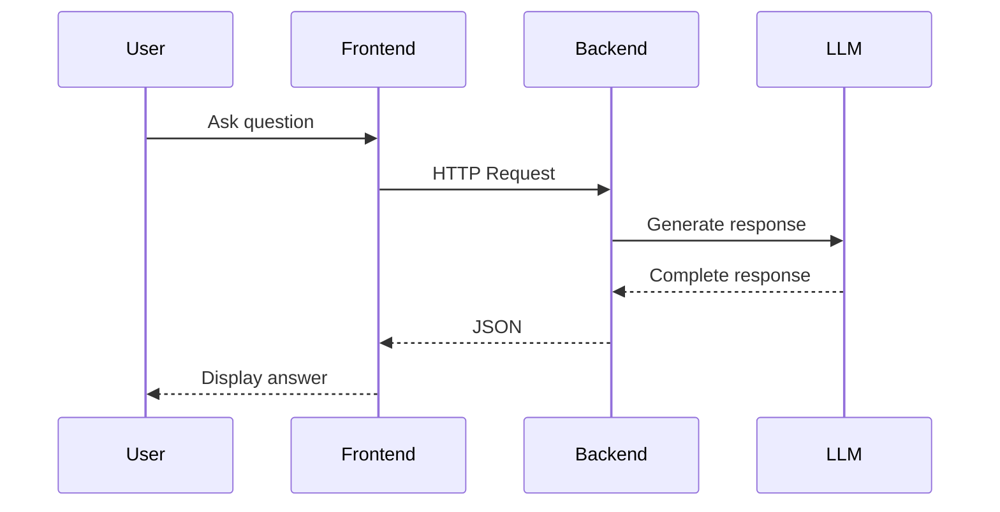
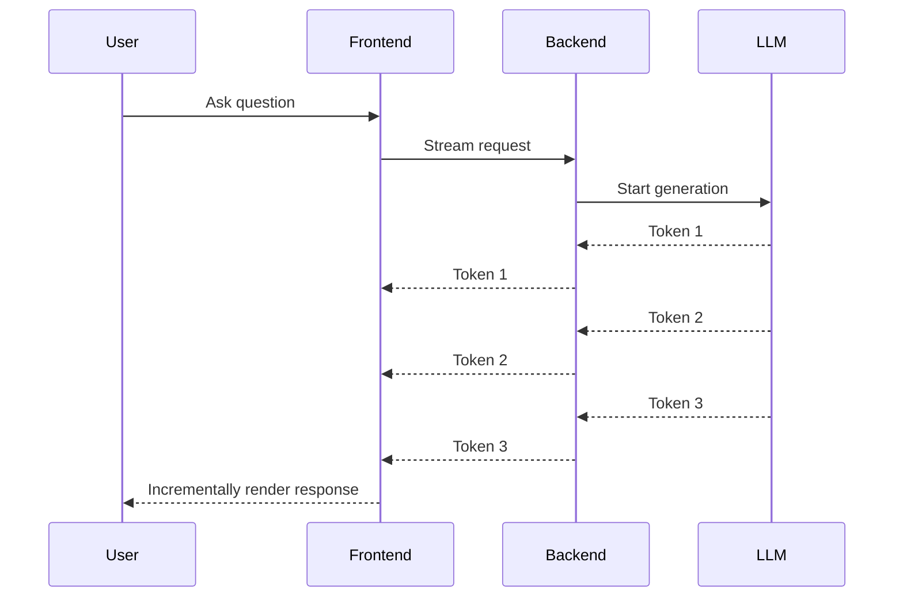

# Day 6 — Streaming Fundamentals

---

# Overview

One of the defining characteristics of modern AI applications is their ability to stream responses as they are generated.

Instead of waiting several seconds for a complete answer, users see text appear incrementally, token by token. This significantly improves perceived responsiveness and creates a more natural conversational experience.

Streaming is not simply a UI enhancement—it is a fundamental architectural pattern used by production AI systems.

---

# Learning Objectives

By the end of today's lesson, you should be able to:

- Explain what streaming is.
- Understand why LLMs generate text incrementally.
- Compare traditional request-response workflows with streaming.
- Recognize the benefits and challenges of streaming.
- Prepare for implementing streaming in AI applications.

---

# Traditional Request-Response

Most web applications use a synchronous request-response model.



The user sees nothing until the model finishes generating the full response.

---

# Streaming Request

Streaming changes the interaction pattern.



The interface updates continuously as new content becomes available.

---

# Why Streaming Matters

Without streaming:

- Long periods of inactivity.
- Higher perceived latency.
- Users may think the application is frozen.

With streaming:

- Immediate visual feedback.
- Higher user confidence.
- Improved engagement.
- Ability to stop generation early.

Streaming improves **perceived performance**, even though the total generation time may remain unchanged.

---

# How LLMs Generate Text

LLMs do not generate an entire response at once.

Instead, they predict one token at a time.

```text
Prompt

↓

Token 1

↓

Token 2

↓

Token 3

↓

Token 4

↓

...

↓

Completed Response
```

Streaming simply exposes these intermediate tokens to the application as they are produced.

---

# Common Streaming Use Cases

Streaming is valuable for:

- AI chat applications
- Code generation
- Document drafting
- Translation
- Summarization
- AI assistants
- Interactive tutoring

In all of these scenarios, progressive output improves usability.

---

# Streaming Architecture

A simplified architecture looks like this:

```mermaid
flowchart LR

User

↓

React UI

↓

AI SDK

↓

AI Backend

↓

LLM

↓

Streaming Response

↓

UI Updates
```

Each layer has a specific responsibility:

- Frontend: Render partial output.
- AI SDK: Manage streaming state.
- Backend: Relay provider events.
- LLM: Generate tokens incrementally.

---

# Benefits of Streaming

Streaming provides several advantages:

- Better perceived performance.
- Progressive rendering.
- Early user feedback.
- Reduced frustration.
- Ability to interrupt generation.
- Improved conversational experience.

---

# Challenges

Streaming also introduces new engineering considerations:

- Partial responses.
- Connection interruptions.
- Error handling.
- UI synchronization.
- Cancellation.
- Buffer management.
- Token accounting.

These challenges require thoughtful application architecture.

---

# Streaming in Our Projects

Both major projects in this roadmap will use streaming:

## AI Chat

Users see responses appear token by token.

## AI Learning Portal

The AI Tutor streams explanations, summaries, and answers while allowing users to stop or continue generation.

Streaming becomes a shared capability provided by AI Core and AI SDK.

---

# Best Practices

- Begin rendering immediately.
- Clearly indicate generation is in progress.
- Preserve partial output if generation stops.
- Handle errors gracefully.
- Keep streaming logic separate from presentation logic.

---

# Common Misconceptions

❌ Streaming makes the model faster.

Reality: Streaming improves perceived responsiveness, not the underlying inference speed.

---

❌ Streaming is only useful for chat applications.

Reality: Any long-running AI generation task benefits from progressive output.

---

# Assignment

Observe three AI products that support streaming.

Examples:

- Claude
- ChatGPT
- GitHub Copilot Chat

Compare:

- Time to first token.
- Rendering behavior.
- Typing indicators.
- Loading states.
- Stop generation support.

Document your observations.

---

# Mini Project

Update the architecture of your AI Chat application.

Add support for:

- Streaming state.
- Partial message rendering.
- Stop Generation action.
- Loading indicators.

Do not implement the functionality yet; focus on the design.

---

# Key Takeaways

- LLMs naturally generate text token by token.
- Streaming exposes these tokens as they are produced.
- Streaming improves perceived responsiveness.
- Progressive rendering enhances user experience.
- Streaming introduces additional architectural complexity.

---

# Revision Notes

- Streaming ≠ faster inference.
- Tokens arrive incrementally.
- UI updates continuously.
- Preserve partial output.
- Streaming requires dedicated architecture.

---

# Knowledge Graph

## Concepts Introduced

- Token Streaming
- Progressive Rendering
- Streaming State
- Time to First Token
- Partial Responses

## Builds Upon

- Day 5 — Context Engineering

## Enables Future Topics

- SSE
- ReadableStream
- AbortController
- Provider Abstraction
- Streaming UX
- Continue Generation

---

# Discussion Notes

Today's lesson introduces the concept of streaming without focusing on implementation details.

In later lessons, we will explore:

- Server-Sent Events (SSE)
- Browser ReadableStream
- Provider normalization
- Buffer management
- AbortController
- Continue Generation
- Stream event abstractions
- Production-grade streaming UX

These concepts will evolve into the streaming architecture used throughout our AI Chat Platform and Learning Portal.

---

# Next Lesson

**Day 7 — Production Streaming Architecture**

We'll move beyond the concept of streaming and explore how production AI systems implement it using Server-Sent Events (SSE), provider abstraction, frontend and backend responsibilities, `ReadableStream`, buffering, cancellation, and scalable multi-provider designs.