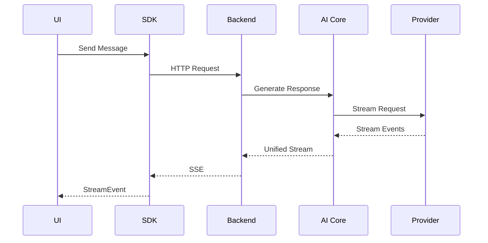

# Day 8 — AI Application Architecture

---

# Overview

As AI applications grow, architectural decisions become more important than provider-specific APIs.

A production AI application should be designed as a collection of reusable layers, each with a clearly defined responsibility.

Instead of embedding AI logic directly into UI components or backend controllers, we separate concerns into AI SDK, AI Backend, AI Core, and Provider Adapters.

This architecture allows multiple applications to reuse the same AI capabilities while remaining independent of any specific LLM provider.

---

# Learning Objectives

By the end of today's lesson, you should be able to:

- Explain the purpose of each architectural layer.
- Understand the responsibilities of AI Core.
- Differentiate AI SDK from AI Backend.
- Recognize why provider abstraction improves maintainability.
- Design reusable AI-enabled applications.

---

# The Layered Architecture

```mermaid
flowchart TD

User

↓

React Application

↓

AI SDK

↓

AI Backend

↓

AI Core

↓

Provider Adapter

↓

Claude/OpenAI/Ollama
```

Each layer communicates only with the layer immediately below it.

---

# React Application

The React application focuses on user interaction.

Responsibilities include:

- Rendering UI
- Managing local state
- Displaying streamed responses
- Handling user input
- Navigation
- Feature-specific workflows

It should not contain prompt construction or provider-specific logic.

---

# AI SDK

The AI SDK is a reusable client-side package that abstracts communication with the backend.

Responsibilities:

- Send requests.
- Stream responses.
- Handle AbortController.
- Normalize frontend events.
- Manage conversation APIs.

Applications consume the SDK rather than calling backend endpoints directly.

Benefits:

- Shared implementation across projects.
- Consistent API.
- Easier testing.
- Cleaner React components.

---

# AI Backend

The backend exposes APIs to frontend applications.

Responsibilities:

- Authentication
- Authorization
- Request validation
- Conversation persistence
- Usage tracking
- Streaming endpoints
- Security
- Rate limiting

The backend should avoid embedding business-specific prompt logic.

---

# AI Core

AI Core is the heart of the platform.

Responsibilities:

- PromptBuilder
- ContextBuilder
- Provider abstraction
- Conversation orchestration
- Tool execution
- Workflow coordination
- Memory integration
- Retrieval orchestration

AI Core should be reusable by multiple applications.

---

# Provider Adapter

Provider Adapters isolate provider-specific APIs.

Examples:

- Anthropic Adapter
- OpenAI Adapter
- Ollama Adapter

Each adapter implements the same internal interface, allowing AI Core to remain provider-independent.

---

# Why This Architecture Matters

Imagine supporting three applications:

- AI Chat
- PR Reviewer
- Learning Portal

Without shared layers:

- Duplicate prompt logic.
- Duplicate streaming code.
- Duplicate provider integrations.
- Inconsistent behavior.

With shared layers:

- Common AI SDK.
- Shared AI Core.
- Shared Provider Adapters.
- Consistent user experience.

---

# Example Request Flow



Notice that the UI never communicates directly with a provider.

---

# Responsibilities by Layer

| Layer | Responsibility |
|--------|----------------|
| React | User experience |
| AI SDK | Client abstraction |
| Backend | APIs and security |
| AI Core | AI orchestration |
| Provider Adapter | Provider-specific implementation |
| Provider | Model inference |

Each layer has one primary responsibility.

---

# Architectural Principles

1. Single Responsibility Principle.
2. Provider independence.
3. Reusable services.
4. Composition over duplication.
5. Clear boundaries.
6. Interface-driven design.

These principles make AI systems easier to evolve.

---

# Common Anti-Patterns

❌ Prompt logic inside React components.

❌ Calling Anthropic SDK directly from the UI.

❌ Business logic inside Provider Adapters.

❌ Backend assembling prompts manually in controllers.

❌ Separate implementations for every application.

---

# Evolution of Our Platform

Today we have:

```text
React

↓

AI SDK

↓

Backend

↓

AI Core
```

Later lessons will expand AI Core with:

- Memory Manager
- Tool Registry
- Agent Framework
- RAG Pipeline
- Semantic Search
- Workflow Engine

The outer architecture remains stable while AI Core grows.

---

# Applying This to Our Projects

## AI Chat

Uses AI SDK for communication, AI Core for orchestration, and Provider Adapters for model interaction.

## AI Learning Portal

Reuses the same AI SDK and AI Core while replacing the user interface and adding a RAG pipeline over MDX lessons.

## PR Reviewer

Shares PromptBuilder, ContextBuilder, Provider Adapters, and streaming infrastructure without duplicating code.

---

# Best Practices

- Keep AI Core framework-agnostic.
- Keep SDK lightweight.
- Expose stable interfaces.
- Share infrastructure across applications.
- Design for provider replacement.

---

# Assignment

Draw the architecture for your AI platform.

Label:

- React Application
- AI SDK
- Backend
- AI Core
- Provider Adapter
- Provider

Describe the responsibility of each layer.

---

# Mini Project

Refactor your AI Chat design so that:

- The UI depends only on AI SDK.
- AI SDK depends only on AI Backend.
- AI Backend delegates AI work to AI Core.
- AI Core uses Provider Adapters.

No layer should skip another.

---

# Key Takeaways

- Layered architecture improves maintainability.
- AI SDK hides backend communication.
- AI Backend manages APIs and security.
- AI Core orchestrates AI workflows.
- Provider Adapters isolate vendor-specific implementations.
- Multiple applications can reuse the same platform.

---

# Revision Notes

- React = UI.
- SDK = Client abstraction.
- Backend = APIs.
- AI Core = AI orchestration.
- Provider Adapter = Vendor isolation.

---

# Knowledge Graph

## Concepts Introduced

- Layered Architecture
- AI SDK
- AI Backend
- AI Core
- Provider Adapter

## Builds Upon

- Day 7 — Production Streaming Architecture

## Enables Future Topics

- AI Core Implementation
- RAG
- Tool Calling
- Agents
- MCP
- AI Learning Portal
- Multi-Application Platform

---

# Discussion Notes

Throughout our roadmap discussions, we evolved from building a single chat application to designing a reusable AI platform.

This architectural shift ensures that future applications—including the AI Learning Portal, PR Reviewer, and any additional AI-enabled products—can share infrastructure instead of reinventing it.

The architecture intentionally isolates UI, backend, orchestration, and provider-specific concerns to maximize maintainability, scalability, and portability.

---

# Next Lesson

**Day 9 — Building AI Core**

We'll move from architecture diagrams to implementation. You'll design the internal modules of AI Core, including PromptBuilder, ContextBuilder, Provider Registry, Conversation Manager, Stream Manager, and the extension points that allow AI Core to evolve into a complete AI platform.